# 实验一：MySQL 在 macOS 上的安装与配置

## 1. 实验目的

- 了解 MySQL 数据库的安装过程
- 熟悉 MySQL 软件环境（命令行客户端与图形化管理工具）
- 学会 MySQL 服务的安装、启停与客户端连接
- 掌握基本的 SQL 连接验证操作

## 2. 实验环境

| 项目 | 配置 |
|------|------|
| 操作系统 | macOS 15（ARM64，Apple Silicon） |
| 数据库 | MySQL Community Server 9.7.0 LTS |
| 安装方式 | DMG 安装包（.pkg 安装器） |
| 命令行工具 | macOS 终端（Terminal）+ mysql 客户端 |
| 图形管理工具 | MySQL Workbench 8.0 |

## 3. 环境选择说明

原实验教材要求使用 **SQL Server 2000**，该版本发布于 2000 年，仅支持 Windows NT/2000 平台，无法在现代 macOS（ARM64）环境下运行。SQL Server 2000 已于 2013 年终止扩展支持，存在安全风险且不兼容当前硬件架构。

因此，本实验选用 **MySQL Community Server 9.7.0 LTS** 作为替代。MySQL 是 Oracle 维护的开源关系型数据库，在 macOS 上有官方原生支持，社区活跃、文档完善，且核心 SQL 语法与标准 SQL 高度一致，不影响对数据库基本原理的学习。

### MySQL 与原实验 SQL Server 2000 对比

| 对比项 | SQL Server 2000（原实验） | MySQL 9.7.0（本实验） |
|--------|--------------------------|----------------------|
| 操作系统 | 仅 Windows NT/2000/XP | macOS 15 (ARM64)，跨平台 |
| 数据库版本 | SQL Server 2000（2000 年发布） | MySQL 9.7.0 LTS（2026 年） |
| 安装方式 | 光盘/ISO 安装向导 | DMG 安装包 + .pkg 安装器 |
| 管理工具 | SQL Server 企业管理器（MMC 控制台） | MySQL Workbench 8.0 |
| SQL 编辑器 | SQL 查询分析器（Query Analyzer） | MySQL Workbench Query Editor + mysql CLI |

## 4. 实验过程

### 4.1 下载 MySQL 安装包

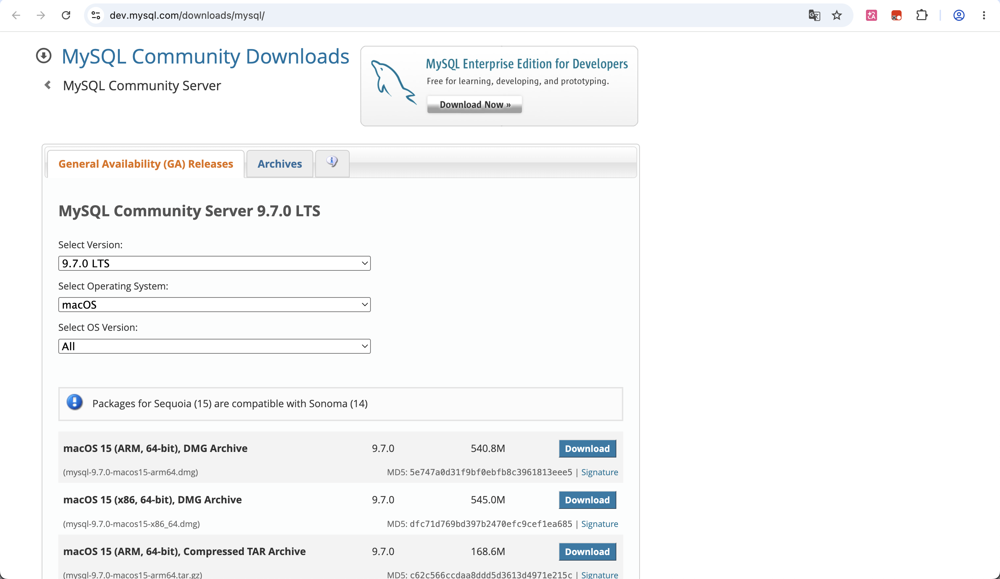

访问 MySQL 官方网站 `dev.mysql.com/downloads/mysql/`，在 "MySQL Community Server 9.7.0 LTS" 页面中，操作系统选择 **macOS**，选择 **macOS 15 (ARM, 64-bit), DMG Archive**（文件大小 540.8M），点击 Download 按钮下载 `mysql-9.7.0-macos15-arm64.dmg`。

### 4.2 打开 DMG 安装包

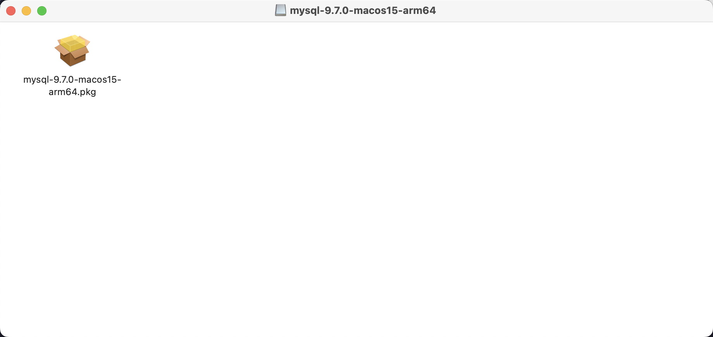

下载完成后，在 Finder 中打开 `mysql-9.7.0-macos15-arm64.dmg`，可以看到其中的 `mysql-9.7.0-macos15-arm64.pkg` 安装包文件。该文件是 macOS 标准的软件安装包格式，适用于 Apple Silicon（M 系列芯片）Mac。

### 4.3 安装向导 — 介绍页

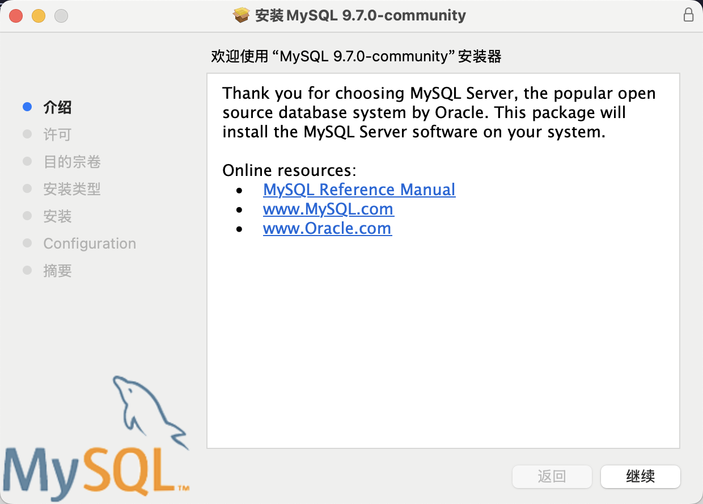

双击 `.pkg` 文件启动安装向导。欢迎页显示"欢迎使用 MySQL 9.7.0-community 安装器"，正文介绍 MySQL Server 是由 Oracle 开发的主流开源数据库系统。页面同时提供 MySQL 参考手册、官方网站和 Oracle 官网链接，点击"继续"进入下一步。

### 4.4 安装进度

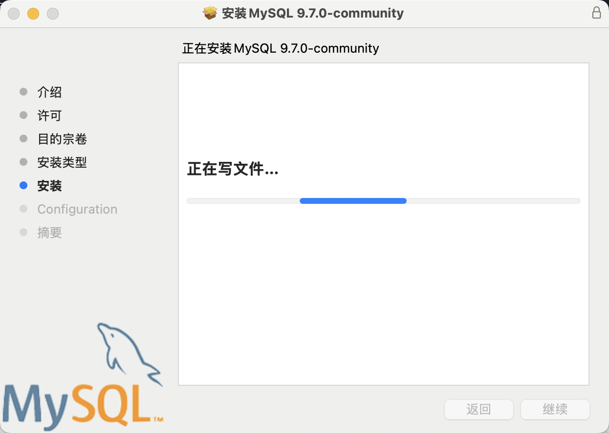

在依次通过许可协议、选择安装目标磁盘、确认安装类型等步骤后，安装器进入"正在安装 MySQL 9.7.0-community"阶段。界面显示"正在写文件..."，蓝色进度条指示安装进度，此时文件正在被复制到系统磁盘。

### 4.5 初始数据库配置

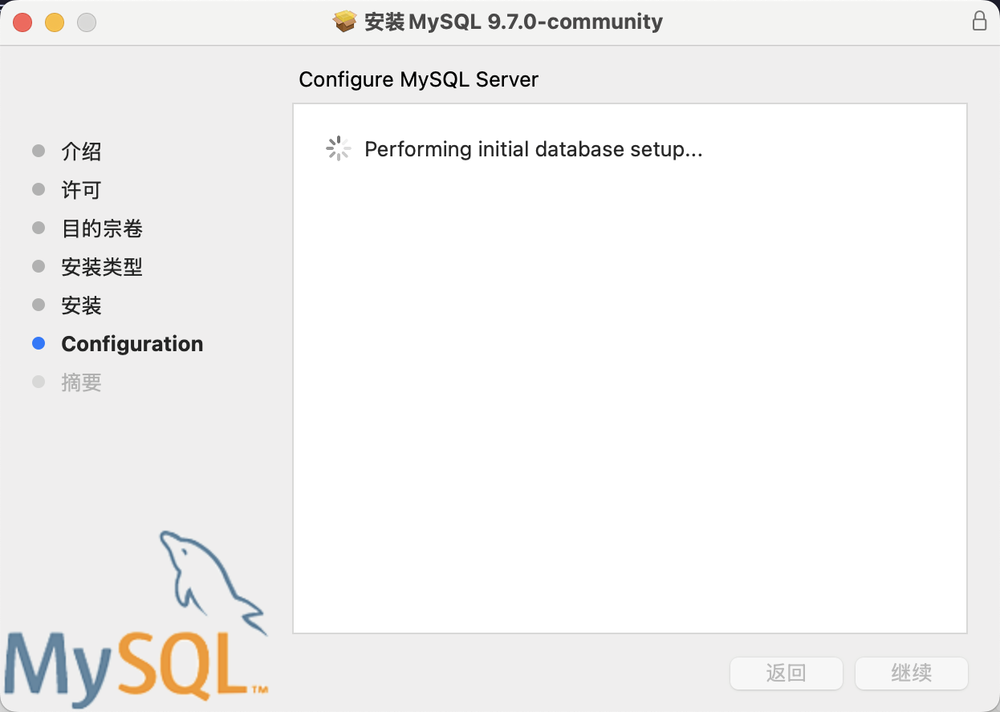

文件复制完成后进入配置阶段（Configuration）。安装器自动执行"Performing initial database setup..."（正在进行初始数据库设置），包括初始化数据目录、创建系统表空间等。安装过程中需要设置 root 用户密码（此处为安装器交互步骤，需输入并确认密码）。

### 4.6 命令行验证 MySQL 版本

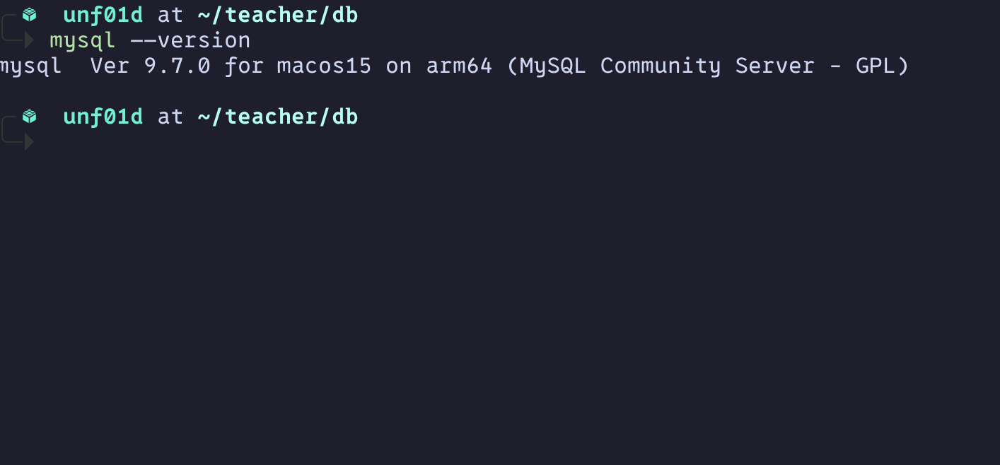

安装完成后，在终端中执行 `mysql --version` 命令验证安装结果。输出显示 `mysql Ver 9.7.0 for macos15 on arm64 (MySQL Community Server - GPL)`，确认 MySQL 客户端已正确安装，版本为 9.7.0，运行在 macOS 15 ARM64 架构上。

### 4.7 命令行登录 MySQL

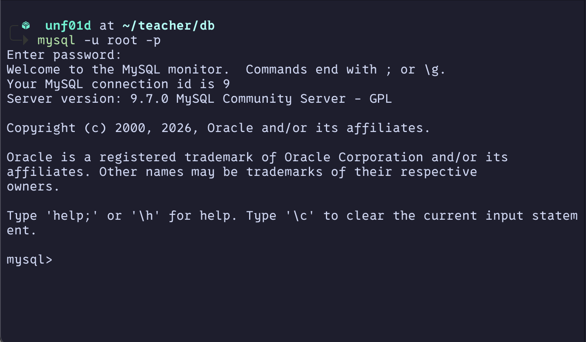

在终端中执行 `mysql -u root -p` 命令，输入安装时设置的 root 密码后成功登录 MySQL。系统显示欢迎信息、连接 ID 为 9、服务器版本为 9.7.0 MySQL Community Server，并提示使用 `help;` 或 `\h` 获取帮助，表示已进入 MySQL 交互式命令行环境。

### 4.8 查询数据库版本

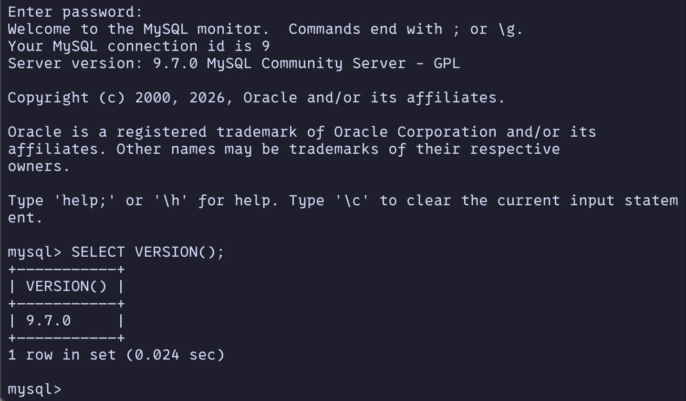

在 `mysql>` 提示符下输入 `SELECT VERSION();` 命令，返回当前数据库服务器版本为 `9.7.0`，查询耗时 0.024 秒，进一步确认数据库服务运行正常。

### 4.9 查看系统数据库

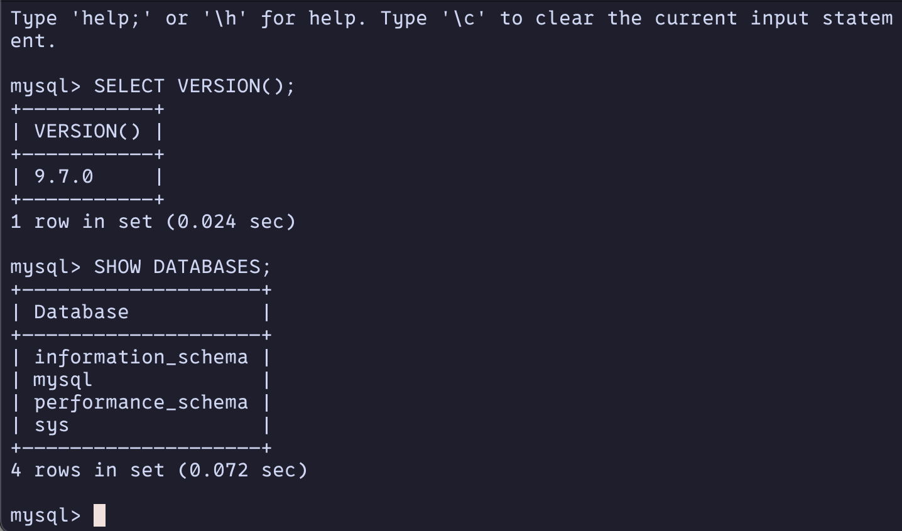

继续执行 `SHOW DATABASES;` 命令，列出当前服务器上的所有数据库：`information_schema`、`mysql`、`performance_schema`、`sys`。这四个是 MySQL 默认的系统数据库，用于存储元数据、用户权限、性能统计等信息，查询返回 4 行，耗时 0.072 秒。

### 4.10 安装 MySQL Workbench

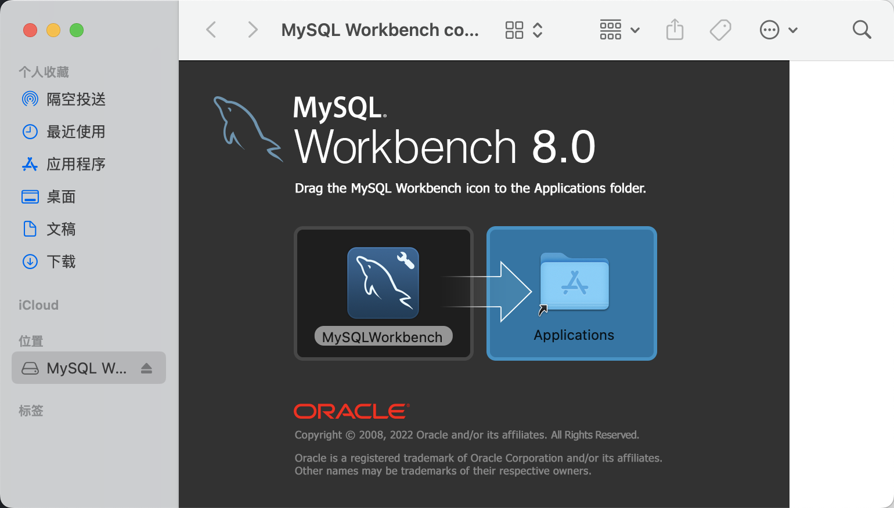

为进一步方便管理，下载并安装 MySQL Workbench 8.0。打开 `MySQL Workbench 8.0` 的 DMG 文件后，按照提示将左侧的 MySQLWorkbench 图标拖拽到右侧 Applications 文件夹中，完成图形化管理工具的安装。

### 4.11 Workbench 连接与查询

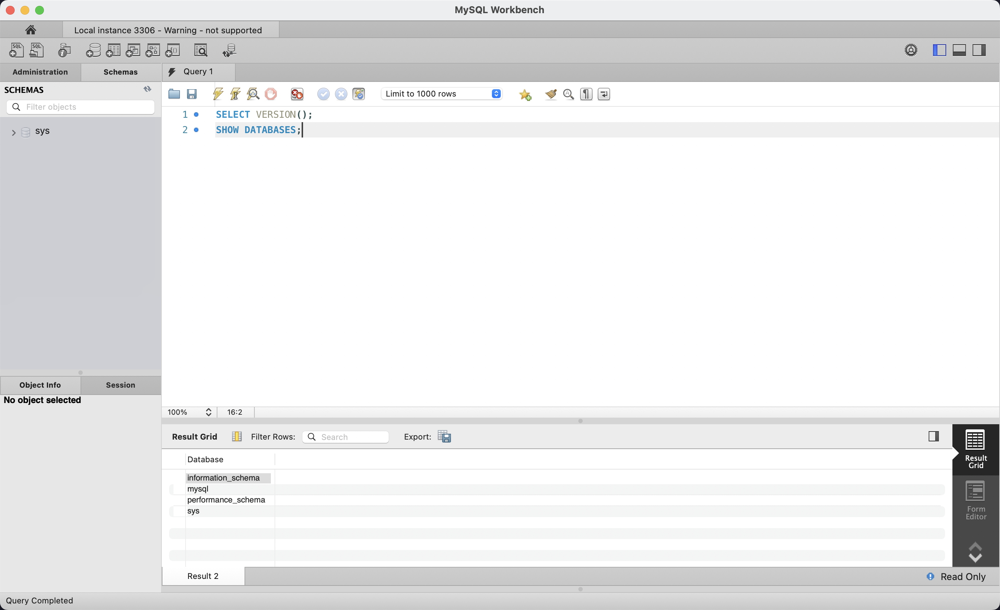

打开 MySQL Workbench，连接到本地 MySQL 实例（Local instance 3306）。在 Query 1 编辑器中输入 `SELECT VERSION();` 和 `SHOW DATABASES;` 两条 SQL 语句并执行。Result Grid 显示了 `SHOW DATABASES` 的查询结果，与命令行输出一致，底部状态栏显示"Query Completed"，确认 Workbench 已成功连接到 MySQL 服务器。

## 5. 实验结果

MySQL Community Server 9.7.0 LTS 已成功安装在 macOS 15（ARM64）环境中，达到以下验证标准：

1. **命令行工具可用**：`mysql --version` 返回正确的版本信息
2. **服务正常运行**：通过 `mysql -u root -p` 成功登录 MySQL Monitor
3. **SQL 查询正常**：`SELECT VERSION()` 返回 `9.7.0`，`SHOW DATABASES` 返回 4 个系统数据库
4. **图形管理工具可用**：MySQL Workbench 8.0 成功连接本地实例，查询结果与命令行一致

MySQL 数据库环境已准备就绪，可进行后续的 SQL 语句学习和数据库操作实验。
