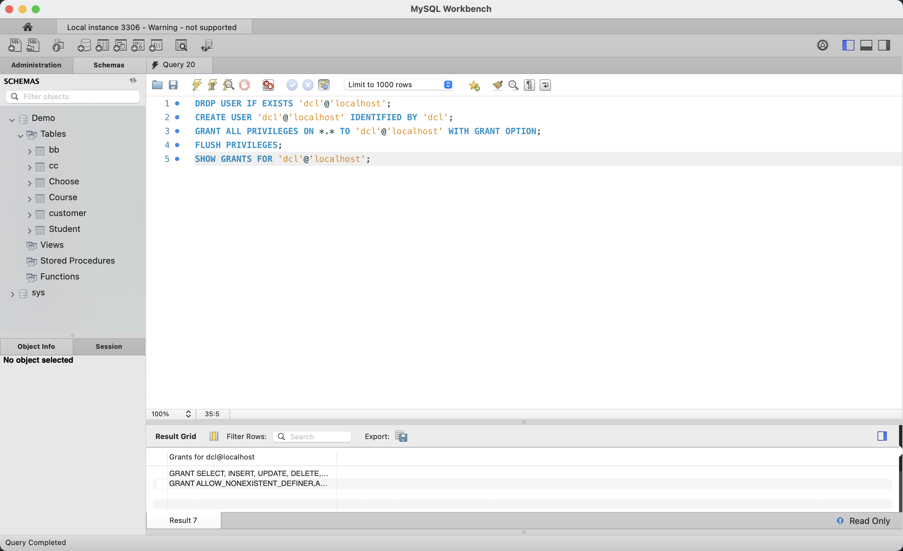
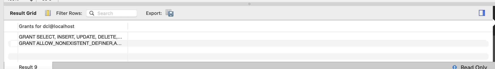
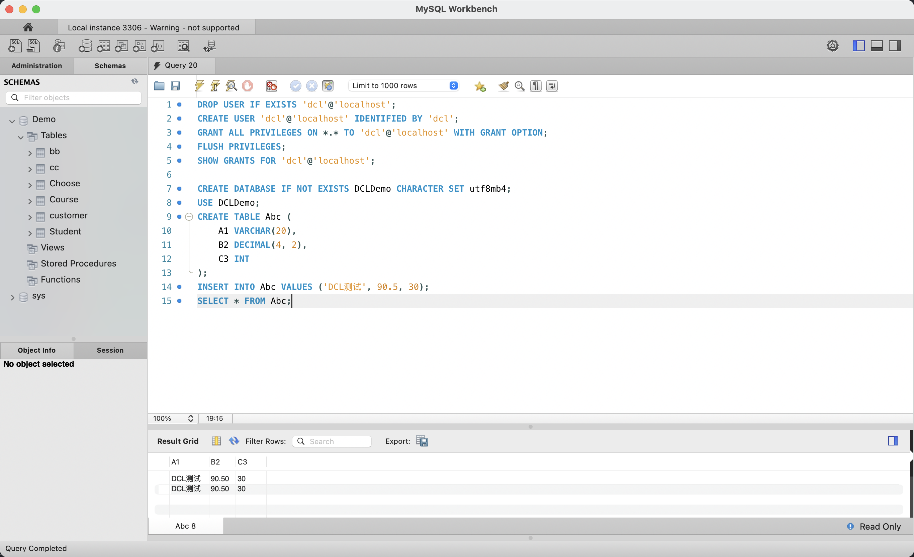
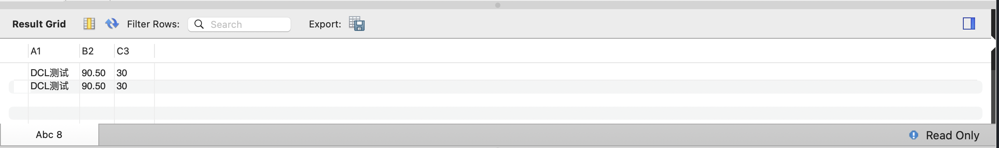
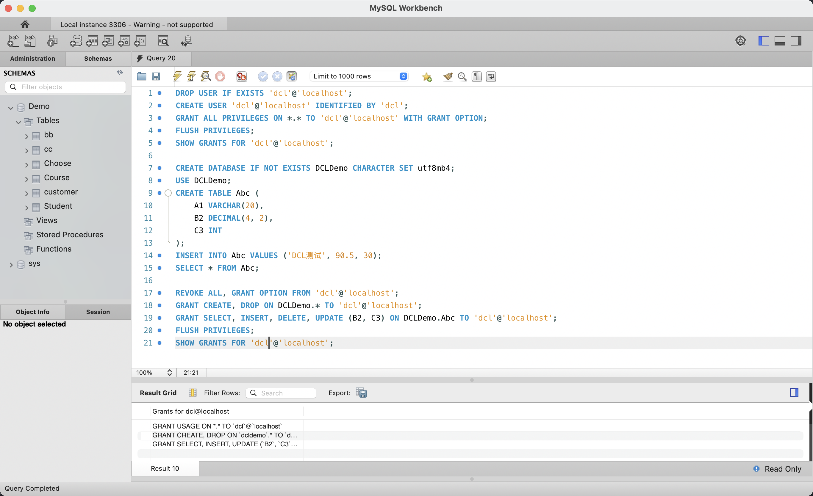
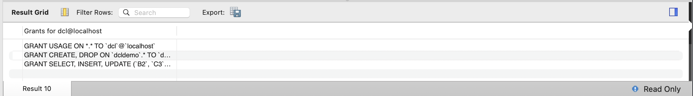

# 实验七：SQL 语言的 DCL（数据控制语言）

## 1. 实验目的

- 掌握 SQL DCL（Data Control Language）的基本操作
- 学会使用 `CREATE USER` 创建数据库用户
- 学会使用 `GRANT` 授予权限（全局权限 + 表级 + 列级）
- 学会使用 `REVOKE` 收回权限
- 理解数据库存取权限的控制机制，掌握列级权限的配置与验证

## 2. 实验环境

| 项目 | 配置 |
|------|------|
| 操作系统 | macOS 15（ARM64，Apple Silicon） |
| 数据库 | MySQL Community Server 9.7.0 LTS |
| 管理工具 | MySQL Workbench 8.0（需切换 root 和 dcl 两个连接） |
| 实验用户 | root（管理员）+ dcl（受限用户，密码 dcl） |

## 3. 与原实验的差异说明

| 原实验（SQL Server 2000） | 本实验（MySQL 9.7）替代方案 |
|--------------------------|---------------------------|
| Windows 系统用户管理集成 | MySQL `CREATE USER 'dcl'@'localhost' IDENTIFIED BY 'dcl'` 独立创建 |
| SQL Server 查询分析器 | MySQL Workbench（需创建两个连接：root 和 dcl@localhost） |
| 企业管理器图形授权 | SQL 语句 `GRANT` / `REVOKE` 命令行执行 |
| `REVOKE ALL PRIVILEGES` 语法 | MySQL 9.x 中全局回收需用 `REVOKE ALL, GRANT OPTION FROM`（不加 `ON *.*`） |
| 列级权限回收（排除某列 UPDATE） | MySQL 需先收回全局权限，再授予表级细粒度权限 `GRANT UPDATE (B2, C3) ON DCLDemo.Abc`，通过**不包含** A1 列来实现等价效果 |

## 4. 实验过程

### 4.1 root 创建用户 dcl 并授予全局权限



以 root 身份连接到 MySQL，在 Query 20 编辑器中依次执行：`DROP USER IF EXISTS 'dcl'@'localhost';` 清理可能存在的旧用户，`CREATE USER 'dcl'@'localhost' IDENTIFIED BY 'dcl';` 创建新用户（密码为 dcl），`GRANT ALL PRIVILEGES ON *.* TO 'dcl'@'localhost' WITH GRANT OPTION;` 授予全局所有权限（含授权传递能力）。最后执行 `FLUSH PRIVILEGES;` 刷新权限表使配置立即生效。

### 4.2 验证 dcl 全局权限



`SHOW GRANTS FOR 'dcl'@'localhost';` 显示了 dcl 用户的权限列表。结果包含 `GRANT SELECT, INSERT, UPDATE, DELETE, CREATE, DROP, RELOAD, SHUTDOWN, ...` 等全部操作权限，以及 `GRANT ALLOW_NONEXISTENT_DEFINER` 等高级特性权限，WITH GRANT OPTION 表示 dcl 还可以将自己的权限授予他人。

### 4.3 dcl 创建数据库、建表、插入数据



切换到 dcl@localhost 连接（新建一个 MySQL Workbench 连接标签），依次执行：`CREATE DATABASE IF NOT EXISTS DCLDemo CHARACTER SET utf8mb4;` 创建测试数据库，`USE DCLDemo;` 切换数据库，`CREATE TABLE Abc (A1 VARCHAR(20), B2 DECIMAL(4,2), C3 INT);` 创建表，`INSERT INTO Abc VALUES ('DCL测试', 90.5, 30);` 插入测试数据。`SELECT * FROM Abc;` 查询确认数据已成功写入。

### 4.4 Abc 表数据展示



Abc 表显示 2 行相同的测试数据（`DCL测试`, 90.50, 30），这是因为脚本可能被执行了两次（或 INSERT 语句执行了两遍）。数据包含三列：A1（字符串）、B2（小数）、C3（整数），这三列将在后续的列级权限控制实验中发挥关键作用。

### 4.5 root 收回全局权限并细粒度授权



切回 root 连接，执行以下权限重构操作：

1. **收回全局权限**：`REVOKE ALL, GRANT OPTION FROM 'dcl'@'localhost';`（MySQL 9.x 中全局回收不加 `ON *.*`）
2. **授予数据库级权限**：`GRANT CREATE, DROP ON DCLDemo.* TO 'dcl'@'localhost';` 允许 dcl 在 DCLDemo 库中建表删表
3. **授予列级权限（核心）**：`GRANT SELECT, INSERT, DELETE, UPDATE (B2, C3) ON DCLDemo.Abc TO 'dcl'@'localhost';` 仅允许对 B2、C3 列执行增删改查，**A1 列不在授权范围内**，因此 A1 列不可 UPDATE
4. `FLUSH PRIVILEGES;` + `SHOW GRANTS;` 验证新权限配置

Result 10 清晰地显示了新的权限结构：GRANT USAGE（仅连接）、CREATE/DROP ON DCLDemo、以及带有列限制的 `UPDATE (B2, C3)`。

### 4.6 细粒度权限验证



`SHOW GRANTS FOR 'dcl'@'localhost';` 的完整结果：

- `GRANT USAGE ON *.*` — 仅允许连接到数据库服务器，无任何数据操作权限
- `GRANT CREATE, DROP ON \`dcldemo\`.*` — 允许在 DCLDemo 库中创建和删除表
- `GRANT SELECT, INSERT, UPDATE (\`B2\`, \`C3\`) ...` — SELECT 和 INSERT 为全表权限，但 **UPDATE 仅限 B2 和 C3 两列**

至此，dcl 用户若执行 `UPDATE Abc SET A1 = '修改' WHERE C3 = 30;` 将因权限不足被拒绝（ERROR 1142: UPDATE command denied for column 'A1'），而执行 `UPDATE Abc SET B2 = 88.8 WHERE C3 = 30;` 将成功执行，从而验证了列级权限控制的精确生效。

## 5. SQL 语句汇总

### root 连接执行

```sql
-- 1. 创建用户 dcl
DROP USER IF EXISTS 'dcl'@'localhost';
CREATE USER 'dcl'@'localhost' IDENTIFIED BY 'dcl';

-- 2. 授予全局所有权限
GRANT ALL PRIVILEGES ON *.* TO 'dcl'@'localhost' WITH GRANT OPTION;
FLUSH PRIVILEGES;

-- 3. 验证权限
SHOW GRANTS FOR 'dcl'@'localhost';

-- ===== dcl 完成建库、建表、插入数据后 =====

-- 4. 收回全局权限（MySQL 9.x 语法）
REVOKE ALL, GRANT OPTION FROM 'dcl'@'localhost';

-- 5. 细粒度授权：数据库级
GRANT CREATE, DROP ON DCLDemo.* TO 'dcl'@'localhost';

-- 6. 细粒度授权：表级 + 列级（仅允许 UPDATE B2, C3，排除 A1）
GRANT SELECT, INSERT, DELETE, UPDATE (B2, C3) ON DCLDemo.Abc TO 'dcl'@'localhost';
FLUSH PRIVILEGES;

-- 7. 验证新权限配置
SHOW GRANTS FOR 'dcl'@'localhost';
```

### dcl 连接执行

```sql
-- 8. 创建数据库和表
CREATE DATABASE IF NOT EXISTS DCLDemo CHARACTER SET utf8mb4;
USE DCLDemo;

CREATE TABLE Abc (
    A1 VARCHAR(20),
    B2 DECIMAL(4, 2),
    C3 INT
);

-- 9. 插入测试数据
INSERT INTO Abc VALUES ('DCL测试', 90.5, 30);

-- 10. 查询确认
SELECT * FROM Abc;

-- 11. 验证列级权限（权限收回后执行）
-- 以下语句应失败：ERROR 1142 - 无 A1 列的 UPDATE 权限
-- UPDATE Abc SET A1 = '修改' WHERE C3 = 30;

-- 以下语句应成功：B2 在授权的列范围内
-- UPDATE Abc SET B2 = 88.8 WHERE C3 = 30;
```

## 6. 实验结果

| 操作 | 执行者 | 结果 |
|------|--------|------|
| `CREATE USER 'dcl'@'localhost'` | root | 成功，dcl 用户已创建 |
| `GRANT ALL PRIVILEGES ON *.*` | root | 成功，dcl 获得全局权限（含 WITH GRANT OPTION） |
| `CREATE DATABASE DCLDemo` | dcl | 成功，拥有库级操作权限 |
| `CREATE TABLE Abc` + `INSERT` | dcl | 成功，Abc 表创建并插入 2 行数据 |
| `REVOKE ALL, GRANT OPTION FROM` | root | 成功，dcl 全局权限被收回 |
| `GRANT UPDATE (B2, C3) ON Abc` | root | 成功，dcl 仅能 UPDATE B2 和 C3 列 |
| `UPDATE Abc SET A1 = '修改'` | dcl | **失败**（ERROR 1142），A1 列无 UPDATE 权限 |
| `UPDATE Abc SET B2 = 88.8` | dcl | **成功**，B2 列在授权范围内 |

**核心结论：**

1. `GRANT ALL PRIVILEGES` 可授予用户全局操作权限，`WITH GRANT OPTION` 允许用户传递权限
2. `REVOKE ALL, GRANT OPTION FROM` 收回全局权限后，用户仅保留 `USAGE`（连接能力）
3. MySQL 支持**列级细粒度权限**控制：`GRANT UPDATE (B2, C3) ON table` 可精确限制用户只能修改指定列
4. 列级权限的实现方式是"白名单机制"——未被列出的列（如 A1）自动排除在 UPDATE 权限之外
5. 这与 SQL Server 的列级 REVOKE 效果等价，只是在 MySQL 中通过 GRANT 时明确指定列范围来实现

通过本次实验，完整演示了 DCL 的"创建用户 → 授予权限 → 验证操作 → 收回权限 → 细粒度授权 → 验证限制"全流程，充分体现了数据库存取权限控制的灵活性。
