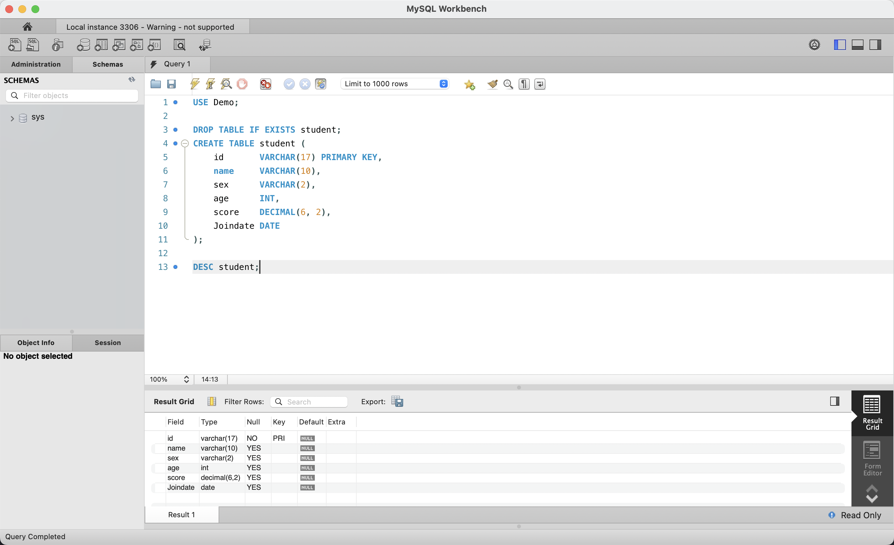
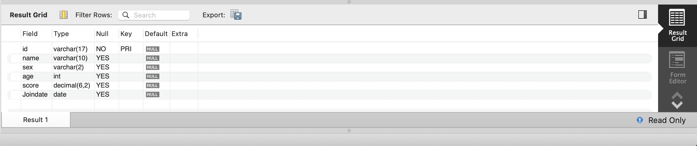
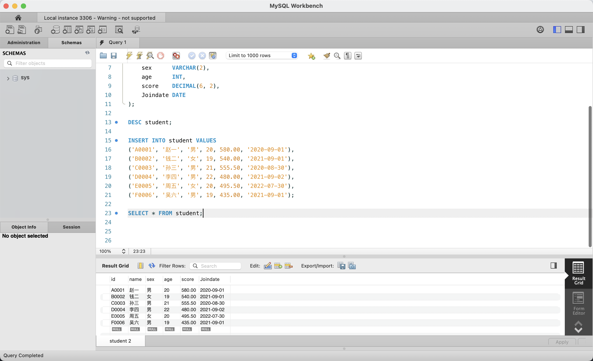
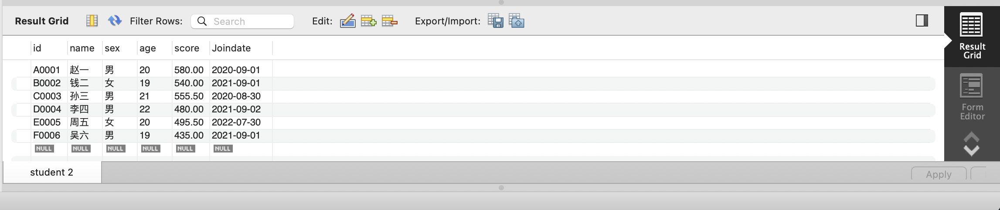
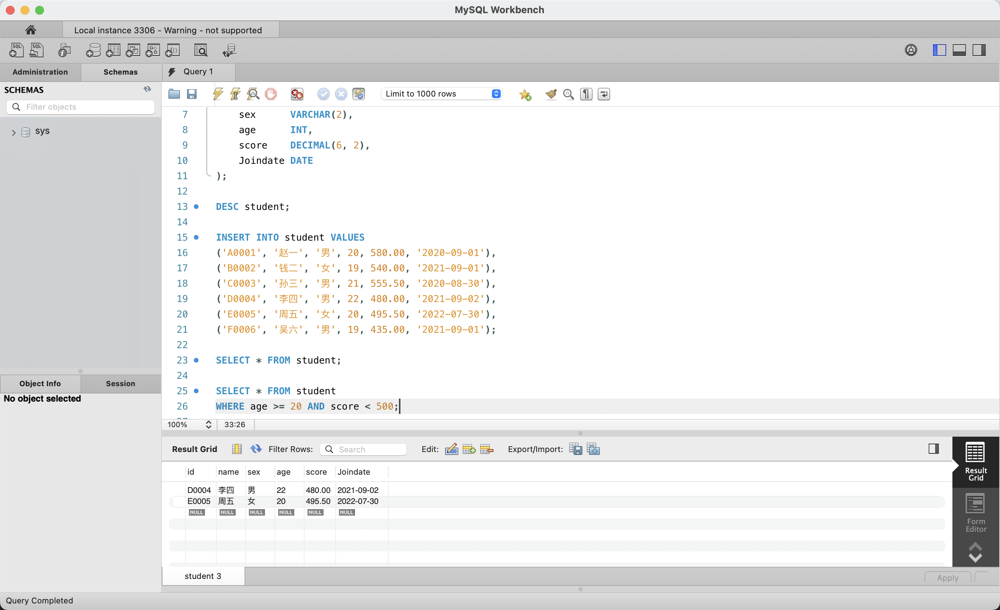
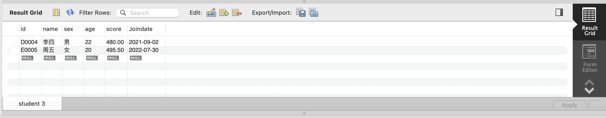
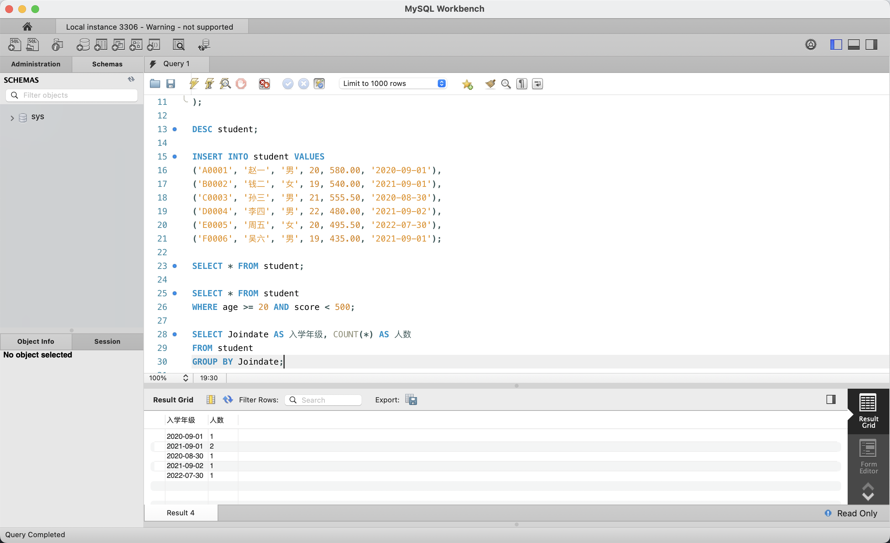
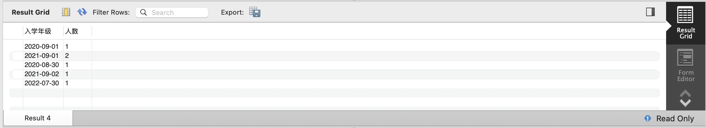

# 实验三：MySQL 建表、插入记录与查询操作

## 1. 实验目的

- 熟悉 MySQL 中用 SQL 语句建表、插入记录、查询记录的基本操作
- 掌握 `CREATE TABLE` 定义表结构的方法
- 掌握 `INSERT INTO` 批量插入数据的方法
- 掌握 `SELECT` 条件查询（`WHERE`）和分组统计（`GROUP BY`）的用法

## 2. 实验环境

| 项目 | 配置 |
|------|------|
| 操作系统 | macOS 15（ARM64，Apple Silicon） |
| 数据库 | MySQL Community Server 9.7.0 LTS |
| 管理工具 | MySQL Workbench 8.0（SQL Editor） |

## 3. 与原实验的差异说明

原实验使用 SQL Server 2000 的"查询分析器"（Query Analyzer）执行 SQL 语句。本实验采用 MySQL Workbench 的 SQL Editor 作为替代。

| 原实验操作 | 本实验替代方案 |
|-----------|---------------|
| SQL Server 查询分析器 | MySQL Workbench SQL Editor（Query 1 标签页） |
| `integer` 数据类型 | `INT`（MySQL 中等价写法） |
| `numeric(p, s)` 数据类型 | `DECIMAL(p, s)`（MySQL 标准精确小数） |
| 其余 SQL 语法（VARCHAR、DATE、SELECT、INSERT、WHERE、GROUP BY） | 完全兼容，无需修改 |

## 4. 实验过程

### 4.1 创建 student 表



在 MySQL Workbench 的 Query 1 编辑器中，先执行 `USE Demo;` 切换到 Demo 数据库，然后执行 `DROP TABLE IF EXISTS student;` 清理可能存在的旧表。接着编写 `CREATE TABLE student (...)` 语句，定义 6 个字段：id（主键）、name、sex、age、score（小数类型）、Joindate（日期类型）。执行后通过 `DESC student;` 验证表结构，Result 1 面板显示了完整的字段列表。

### 4.2 查看表结构



`DESC student;` 返回了 student 表的详细结构，包含 6 个字段：`id` 为 varchar(17) 主键（PRI，非空），`name` 为 varchar(10)，`sex` 为 varchar(2)，`age` 为 int，`score` 为 decimal(6,2)，`Joindate` 为 date。除 id 外其余字段均允许为空。

### 4.3 插入数据并查询全表



使用 `INSERT INTO student VALUES` 语句批量插入 6 条学生记录，包含学号、姓名、性别、年龄、分数和入学日期。随后执行 `SELECT * FROM student;` 查询全表数据，Result Grid 以表格形式展示了全部 6 行记录，底部状态栏显示 "Query Completed"。

### 4.4 全表数据展示



`SELECT * FROM student;` 的查询结果清晰地列出了 6 名学生的全部信息：

| id | name | sex | age | score | Joindate |
|----|------|-----|-----|-------|----------|
| A0001 | 赵一 | 男 | 20 | 580.00 | 2020-09-01 |
| B0002 | 钱二 | 女 | 19 | 540.00 | 2021-09-01 |
| C0003 | 孙三 | 男 | 21 | 555.50 | 2020-08-30 |
| D0004 | 李四 | 男 | 22 | 480.00 | 2021-09-02 |
| E0005 | 周五 | 女 | 20 | 495.50 | 2022-07-30 |
| F0006 | 吴六 | 男 | 19 | 435.00 | 2021-09-01 |

### 4.5 条件查询（WHERE）



执行 `SELECT * FROM student WHERE age >= 20 AND score < 500;` 条件查询，筛选年龄大于等于 20 且分数低于 500 的学生。该语句使用了 `AND` 组合两个条件，Result Grid 返回了匹配的 2 条记录：李四（22 岁，480.00）和周五（20 岁，495.50），底部标签显示 "student 3"。

### 4.6 条件查询结果



条件查询结果仅返回 2 行，验证了 WHERE 子句的过滤效果：

| id | name | sex | age | score | Joindate |
|----|------|-----|-----|-------|----------|
| D0004 | 李四 | 男 | 22 | 480.00 | 2021-09-02 |
| E0005 | 周五 | 女 | 20 | 495.50 | 2022-07-30 |

### 4.7 分组统计（GROUP BY）



编写分组统计查询：`SELECT Joindate AS 入学年级, COUNT(*) AS 人数 FROM student GROUP BY Joindate;`。该语句按入学日期（Joindate）分组，使用 `COUNT(*)` 统计每组人数，并通过 `AS` 别名使列名显示为中文"入学年级"和"人数"。编辑器中同时可见前面的所有 SQL 语句（建表、插入、条件查询），标签页 "Result 4" 显示了统计结果。

### 4.8 分组统计结果



GROUP BY 统计结果显示共有 5 个入学日期，其中 `2021-09-01` 人数最多为 2 人（钱二和吴六），其余日期各 1 人：

| 入学年级 | 人数 |
|----------|------|
| 2020-09-01 | 1 |
| 2021-09-01 | 2 |
| 2020-08-30 | 1 |
| 2021-09-02 | 1 |
| 2022-07-30 | 1 |

## 5. SQL 语句汇总

```sql
-- 切换到 Demo 数据库
USE Demo;

-- 1. 删除已存在的 student 表（清理环境）
DROP TABLE IF EXISTS student;

-- 2. 创建 student 表
CREATE TABLE student (
    id        VARCHAR(17)   PRIMARY KEY,
    name      VARCHAR(10),
    sex       VARCHAR(2),
    age       INT,
    score     DECIMAL(6, 2),
    Joindate  DATE
);

-- 3. 查看表结构
DESC student;

-- 4. 批量插入 6 条学生记录
INSERT INTO student VALUES
('A0001', '赵一', '男', 20, 580.00, '2020-09-01'),
('B0002', '钱二', '女', 19, 540.00, '2021-09-01'),
('C0003', '孙三', '男', 21, 555.50, '2020-08-30'),
('D0004', '李四', '男', 22, 480.00, '2021-09-02'),
('E0005', '周五', '女', 20, 495.50, '2022-07-30'),
('F0006', '吴六', '男', 19, 435.00, '2021-09-01');

-- 5. 查询全表数据
SELECT * FROM student;

-- 6. 条件查询：年龄 >= 20 且分数 < 500
SELECT * FROM student
WHERE age >= 20 AND score < 500;

-- 7. 分组统计：按入学日期统计人数
SELECT Joindate AS 入学年级, COUNT(*) AS 人数
FROM student
GROUP BY Joindate;
```

## 6. 实验结果

1. **student 表创建成功**：`DESC student;` 返回 6 个字段的完整定义，id 已正确设置为主键，数据类型和约束均符合建表语句
2. **数据插入成功**：`SELECT * FROM student;` 返回 6 行完整记录，所有字段值正确存入
3. **条件查询正确**：`WHERE age >= 20 AND score < 500` 准确筛选出李四（22 岁/480 分）和周五（20 岁/495.5 分），共 2 条记录
4. **分组统计正确**：`GROUP BY Joindate` 按入学日期分为 5 组，其中 2021-09-01 组有 2 人，其余各 1 人，计数结果与实际数据一致

本次实验在 MySQL Workbench 中完整演示了从建表、插入数据到条件查询、分组统计的全流程，所有 SQL 语句执行结果均符合预期。
