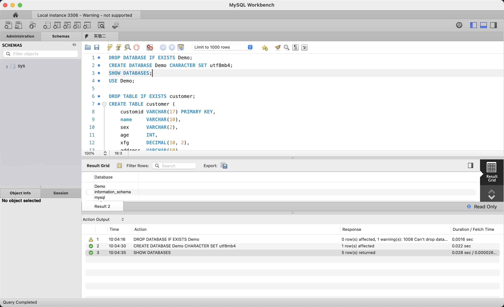
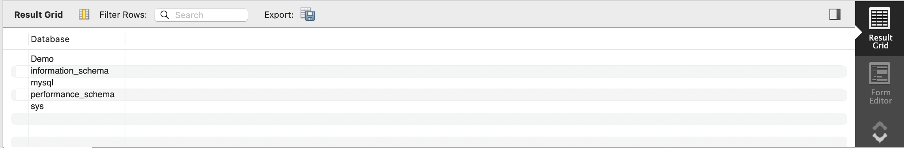
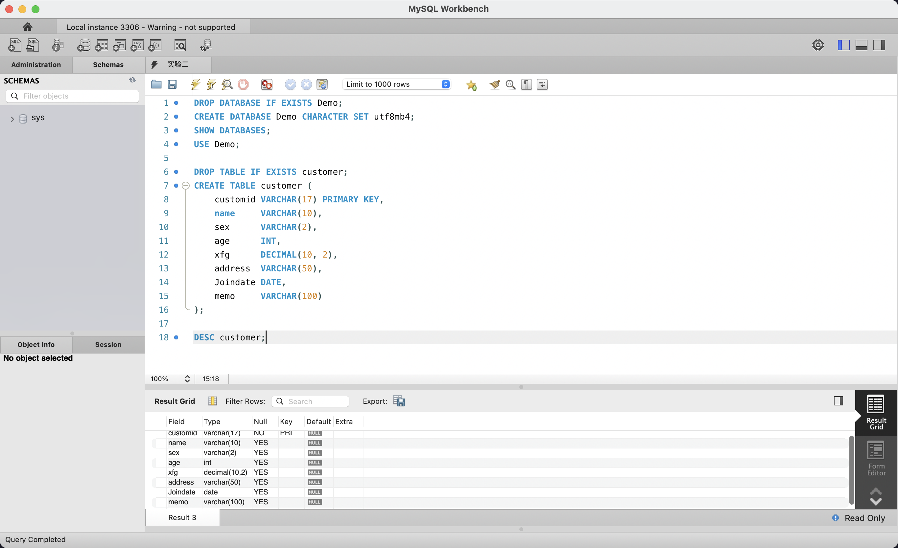
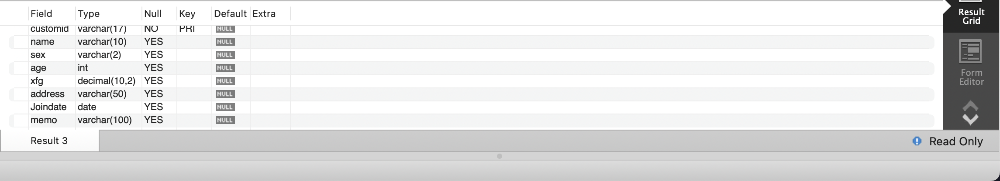

# 实验二：MySQL 服务的启动、建库与建表

## 1. 实验目的

- 了解 MySQL 服务的启动方式
- 学会使用 SQL 语句在 MySQL 中创建数据库（CREATE DATABASE）
- 学会使用 SQL 语句在 MySQL 中创建表（CREATE TABLE）
- 掌握 DESC 命令查看表结构的方法

## 2. 实验环境

| 项目 | 配置 |
|------|------|
| 操作系统 | macOS 15（ARM64，Apple Silicon） |
| 数据库 | MySQL Community Server 9.7.0 LTS |
| 管理工具 | MySQL Workbench 8.0 |
| 命令行 | macOS 终端（Terminal） |

## 3. 与原实验的差异说明

原实验要求使用 SQL Server 2000 的企业管理器和图形向导完成建库建表操作。由于本实验环境为 macOS + MySQL，采用以下替代方案：

| 原实验操作 | 本实验替代方案 |
|-----------|---------------|
| SQL Server 服务管理器 → 启动/停止服务 | `mysql.server start` / `mysql.server status` 命令 |
| 企业管理器图形界面建库 | SQL 语句 `CREATE DATABASE Demo;` |
| 企业管理器图形界面建表 | SQL 语句 `CREATE TABLE customer (...);` |
| 指定数据文件/日志文件初始大小 | MySQL InnoDB 使用共享表空间（`ibdata1`），按需自动扩展，不支持库级别单独指定文件大小，故省略此步骤 |
| 查看表结构 | SQL 语句 `DESC customer;` |

## 4. 实验过程

### 4.1 启动 MySQL 服务

在终端中执行以下命令启动 MySQL 服务并检查状态：

```bash
mysql.server start
mysql.server status
```

确认服务状态为 **SUCCESS**（服务正在运行）后，即可通过 MySQL Workbench 或命令行客户端连接。

### 4.2 创建数据库 Demo



在 MySQL Workbench 中新建 SQL 脚本（命名为"实验二"），编写完整的建库与建表语句。先执行 `DROP DATABASE IF EXISTS Demo;` 确保环境干净，再执行 `CREATE DATABASE Demo CHARACTER SET utf8mb4;` 创建数据库，指定字符集为 utf8mb4 以支持完整 Unicode。底部 Action Output 面板显示：DROP DATABASE 产生 1 条警告（数据库尚不存在），CREATE DATABASE 成功（1 row affected），SHOW DATABASES 返回 5 行结果，其中包含刚创建的 Demo。

### 4.3 验证数据库创建



执行 `SHOW DATABASES;` 查看当前所有数据库。Result Grid 显示数据库列表包含 **Demo**、information_schema、mysql、performance_schema、sys，确认 Demo 数据库已成功创建。

### 4.4 创建 customer 表并查看结构



执行 `USE Demo;` 切换到 Demo 数据库后，执行 `DROP TABLE IF EXISTS customer;` 清理可能存在的旧表，然后执行完整的 `CREATE TABLE customer (...)` 语句创建客户表。最后执行 `DESC customer;` 查看表结构。编辑器中可以看到完整的 SQL 脚本（共 18 行），Result Grid 显示了 customer 表的字段定义。

### 4.5 表结构详情



`DESC customer;` 的执行结果展示了 customer 表的完整结构，共 8 个字段：

| 字段 | 类型 | 说明 |
|------|------|------|
| customid | varchar(17) | 客户编号，主键（PRI） |
| name | varchar(10) | 姓名 |
| sex | varchar(2) | 性别 |
| age | int | 年龄 |
| xfg | decimal(10,2) | （消费额相关字段） |
| address | varchar(50) | 地址 |
| Joindate | date | 加入日期 |
| memo | varchar(100) | 备注 |

底部状态栏显示 "Query Completed"，确认查询执行成功。

## 5. SQL 语句汇总

```sql
-- 1. 删除已存在的 Demo 数据库（清理环境）
DROP DATABASE IF EXISTS Demo;

-- 2. 创建 Demo 数据库，字符集为 utf8mb4
CREATE DATABASE Demo CHARACTER SET utf8mb4;

-- 3. 查看所有数据库，确认 Demo 已创建
SHOW DATABASES;

-- 4. 切换到 Demo 数据库
USE Demo;

-- 5. 删除已存在的 customer 表（清理环境）
DROP TABLE IF EXISTS customer;

-- 6. 创建 customer 客户表
CREATE TABLE customer (
    customid  VARCHAR(17)  PRIMARY KEY,
    name      VARCHAR(10),
    sex       VARCHAR(2),
    age       INT,
    xfg       DECIMAL(10, 2),
    address   VARCHAR(50),
    Joindate  DATE,
    memo      VARCHAR(100)
);

-- 7. 查看 customer 表结构，验证建表结果
DESC customer;
```

## 6. 实验结果

1. **MySQL 服务正常启动**：通过 `mysql.server start` 启动服务，`mysql.server status` 确认运行状态为 SUCCESS
2. **Demo 数据库创建成功**：`SHOW DATABASES;` 结果中包含 Demo，字符集为 utf8mb4
3. **customer 表创建成功**：`DESC customer;` 返回完整的 8 字段结构，customid 已设置为主键（PRI），各字段类型和约束均符合建表语句定义
4. **Workbench 完成全部操作**：从建库到建表全程在 MySQL Workbench 中通过 SQL 语句完成，Action Output 面板实时反馈每条语句的执行状态

MySQL 数据库 Demo 和表 customer 已就绪，可用于后续的数据插入、查询修改等实验操作。
