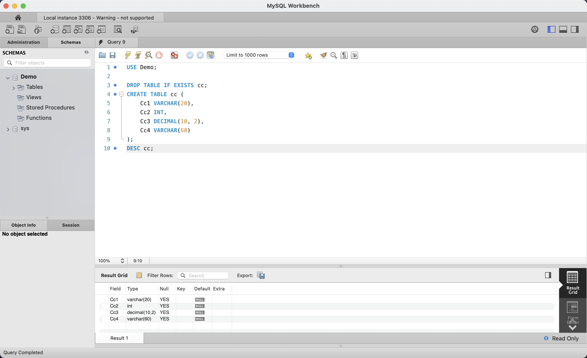
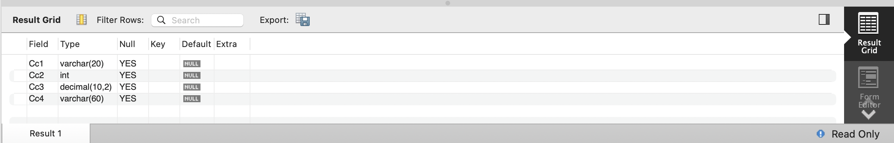
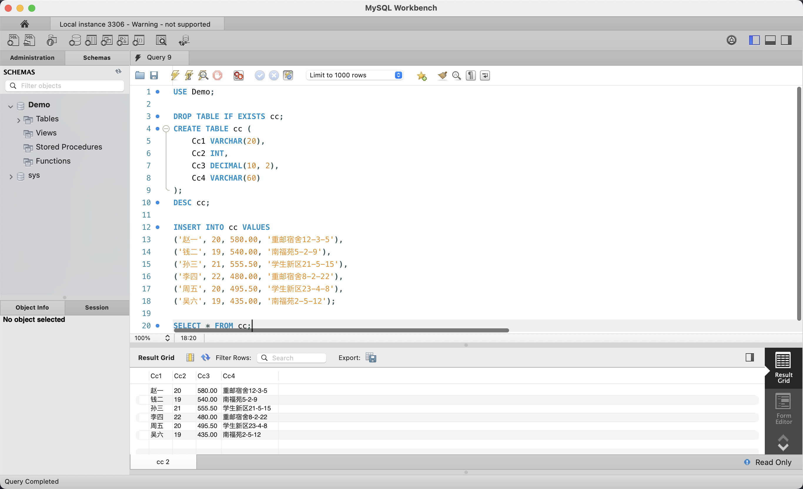
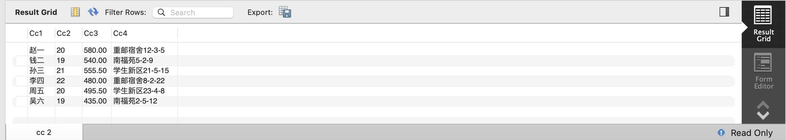
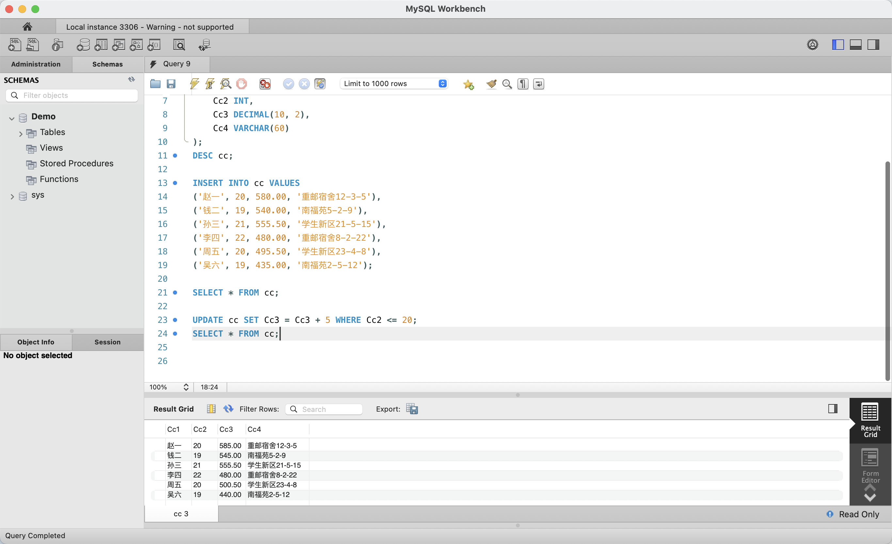
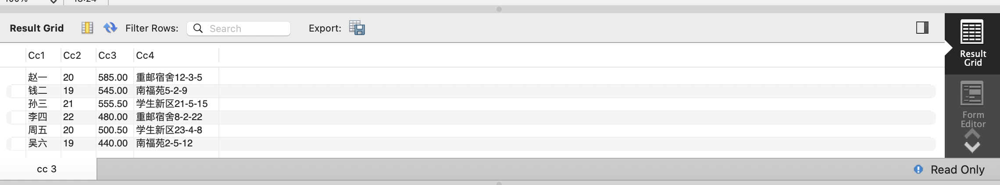
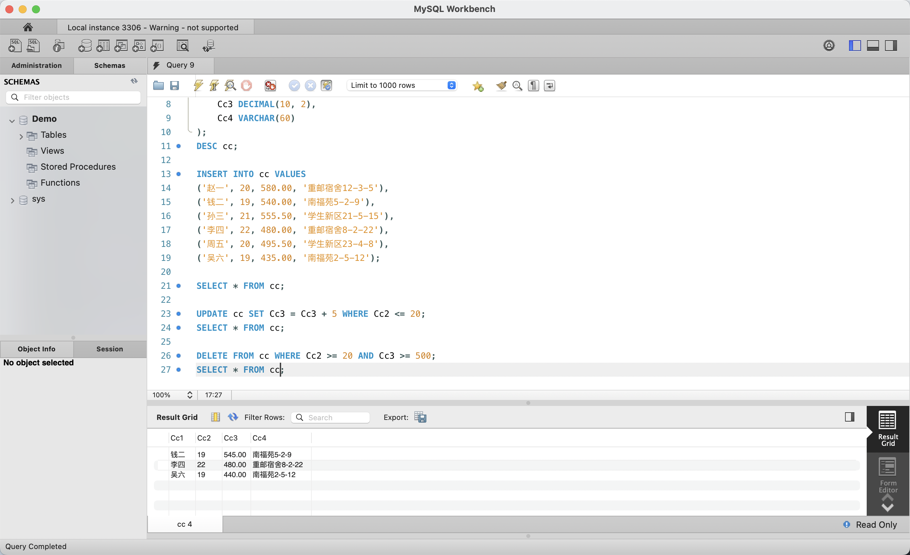
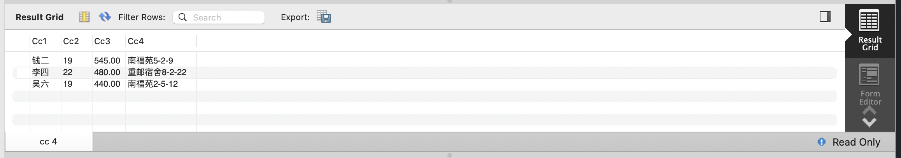

# 实验五：SQL 语言的 DML 初步（数据操纵语言）

## 1. 实验目的

- 掌握 SQL DML（Data Manipulation Language）的基本操作
- 学会使用 `INSERT INTO` 向表中插入数据
- 学会使用 `UPDATE ... SET ... WHERE` 修改表中满足条件的记录
- 学会使用 `DELETE FROM ... WHERE` 删除表中满足条件的记录

## 2. 实验环境

| 项目 | 配置 |
|------|------|
| 操作系统 | macOS 15（ARM64，Apple Silicon） |
| 数据库 | MySQL Community Server 9.7.0 LTS |
| 管理工具 | MySQL Workbench 8.0（SQL Editor） |

## 3. 与原实验的差异说明

原实验使用 SQL Server 2000 的查询分析器执行 DML 语句。本实验采用 MySQL Workbench SQL Editor 作为替代。

| 原实验 | 本实验 |
|--------|--------|
| SQL Server 查询分析器 | MySQL Workbench SQL Editor |
| `Dec(p, s)` 类型 | `DECIMAL(p, s)` |
| INSERT / UPDATE / DELETE 语法 | 完全兼容，无需修改 |

## 4. 实验过程

### 4.1 创建表 cc 并查看结构



在 Query 9 编辑器中，先执行 `USE Demo;` 切换到 Demo 数据库，然后执行 `DROP TABLE IF EXISTS cc;` 清理旧表。使用 `CREATE TABLE cc` 创建包含 4 个字段的表：`Cc1 VARCHAR(20)`（姓名）、`Cc2 INT`（年龄）、`Cc3 DECIMAL(10, 2)`（分数/金额）、`Cc4 VARCHAR(60)`（地址）。`DESC cc;` 的结果在 Result 1 面板中显示。

### 4.2 表 cc 结构详情



`DESC cc;` 返回了 cc 表的 4 个字段定义：Cc1 为 varchar(20)、Cc2 为 int、Cc3 为 decimal(10,2)、Cc4 为 varchar(60)，所有字段均允许为空，无主键约束，默认值均为 NULL。

### 4.3 插入 6 条记录



使用 `INSERT INTO cc VALUES` 语句批量插入 6 条学生数据，包含姓名（赵一钱二孙三李四周五吴六）、年龄、分数和地址信息。随后执行 `SELECT * FROM cc;` 验证插入结果，Result Grid 以表格形式展示了全部 6 行记录。

### 4.4 初始数据展示



插入后的全部数据如下，这是 UPDATE 操作前的原始状态：

| Cc1 | Cc2 | Cc3 | Cc4 |
|-----|-----|-----|-----|
| 赵一 | 20 | 580.00 | 重邮宿舍12-3-5 |
| 钱二 | 19 | 540.00 | 南福苑5-2-9 |
| 孙三 | 21 | 555.50 | 学生新区21-5-15 |
| 李四 | 22 | 480.00 | 重邮宿舍8-2-22 |
| 周五 | 20 | 495.50 | 学生新区23-4-8 |
| 吴六 | 19 | 435.00 | 南福苑2-5-12 |

### 4.5 UPDATE — 条件更新数据



执行 `UPDATE cc SET Cc3 = Cc3 + 5 WHERE Cc2 <= 20;` 对年龄（Cc2）≤ 20 的记录的 Cc3 字段加 5。然后执行 `SELECT * FROM cc;` 查看更新结果。可以看到赵一（20 岁）的 Cc3 从 580.00 → **585.00**、钱二（19 岁）从 540.00 → **545.00**、周五（20 岁）从 495.50 → **500.50**、吴六（19 岁）从 435.00 → **440.00**；而孙三（21 岁）和李四（22 岁）因不满足条件，C31 未发生变化。

### 4.6 更新后数据展示



UPDATE 后数据对比原始值（加粗项为变更值）：

| Cc1 | Cc2 | Cc3 | Cc4 | 变化 |
|-----|-----|-----|-----|------|
| 赵一 | 20 | **585.00** | 重邮宿舍12-3-5 | +5 |
| 钱二 | 19 | **545.00** | 南福苑5-2-9 | +5 |
| 孙三 | 21 | 555.50 | 学生新区21-5-15 | 不变 |
| 李四 | 22 | 480.00 | 重邮宿舍8-2-22 | 不变 |
| 周五 | 20 | **500.50** | 学生新区23-4-8 | +5 |
| 吴六 | 19 | **440.00** | 南福苑2-5-12 | +5 |

### 4.7 DELETE — 条件删除数据



执行 `DELETE FROM cc WHERE Cc2 >= 20 AND Cc3 >= 500;` 删除同时满足"年龄 ≥ 20"且"分数 ≥ 500"的记录。然后执行 `SELECT * FROM cc;` 验证删除结果。Result Grid 仅剩 3 行：**钱二**（19 岁不满足第一个条件）、**李四**（480.00 不满足第二个条件）、**吴六**（19 岁不满足第一个条件）。赵一、孙三、周五三条记录被删除。

### 4.8 删除后剩余数据



DELETE 操作后剩余 3 条记录，确认删除条件 `Cc2 >= 20 AND Cc3 >= 500` 精确命中了赵一（20/585）、孙三（21/555.50）、周五（20/500.50）：

| Cc1 | Cc2 | Cc3 | Cc4 |
|-----|-----|-----|-----|
| 钱二 | 19 | 545.00 | 南福苑5-2-9 |
| 李四 | 22 | 480.00 | 重邮宿舍8-2-22 |
| 吴六 | 19 | 440.00 | 南福苑2-5-12 |

## 5. SQL 语句汇总

```sql
-- 切换到 Demo 数据库
USE Demo;

-- 1. 创建表 cc
DROP TABLE IF EXISTS cc;
CREATE TABLE cc (
    Cc1 VARCHAR(20),
    Cc2 INT,
    Cc3 DECIMAL(10, 2),
    Cc4 VARCHAR(60)
);
DESC cc;

-- 2. 插入 6 条记录
INSERT INTO cc VALUES
('赵一', 20, 580.00, '重邮宿舍12-3-5'),
('钱二', 19, 540.00, '南福苑5-2-9'),
('孙三', 21, 555.50, '学生新区21-5-15'),
('李四', 22, 480.00, '重邮宿舍8-2-22'),
('周五', 20, 495.50, '学生新区23-4-8'),
('吴六', 19, 435.00, '南福苑2-5-12');

-- 3. 查询全表（原始数据）
SELECT * FROM cc;

-- 4. 更新：年龄 ≤ 20 的记录，Cc3 加 5
UPDATE cc SET Cc3 = Cc3 + 5 WHERE Cc2 <= 20;

-- 5. 查询全表（验证更新）
SELECT * FROM cc;

-- 6. 删除：年龄 ≥ 20 且 Cc3 ≥ 500 的记录
DELETE FROM cc WHERE Cc2 >= 20 AND Cc3 >= 500;

-- 7. 查询全表（验证删除）
SELECT * FROM cc;
```

## 6. 实验结果

| 操作 | 受影响行 | 结果 |
|------|---------|------|
| INSERT | 6 行 | 全部插入成功，SELECT 返回 6 行 |
| UPDATE（Cc2 ≤ 20） | 4 行 | 赵一 580→585、钱二 540→545、周五 495.5→500.5、吴六 435→440；孙三、李四不变 |
| DELETE（Cc2 ≥ 20 AND Cc3 ≥ 500） | 3 行 | 赵一、孙三、周五被删除；钱二（19 岁）、李四（480 分）、吴六（19 岁）保留 |

INSERT、UPDATE、DELETE 三个 DML 核心操作均执行成功，条件筛选精准，数据变化符合预期。表中最终保留 3 条记录，实验目标达成。
