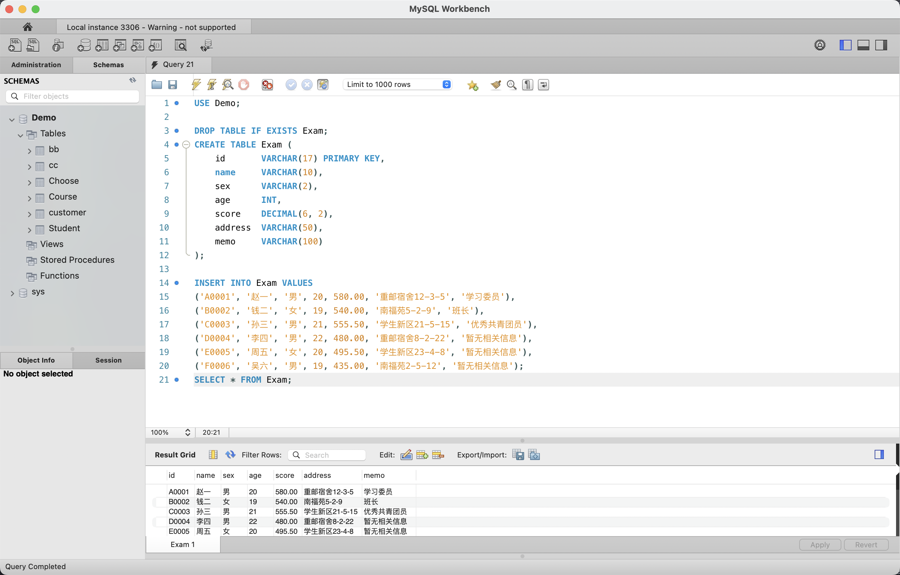
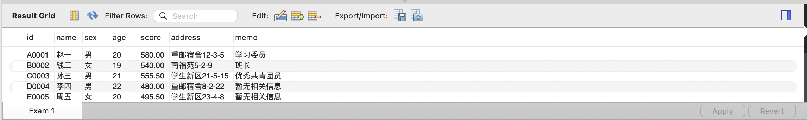
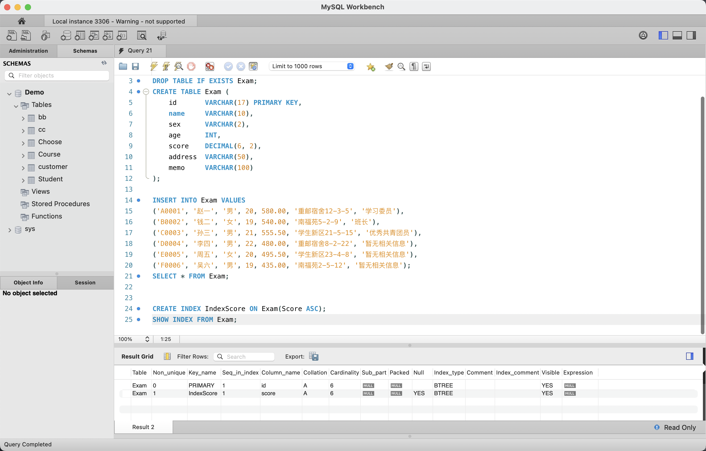
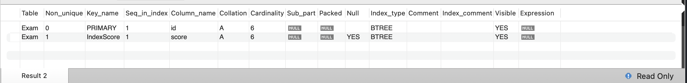
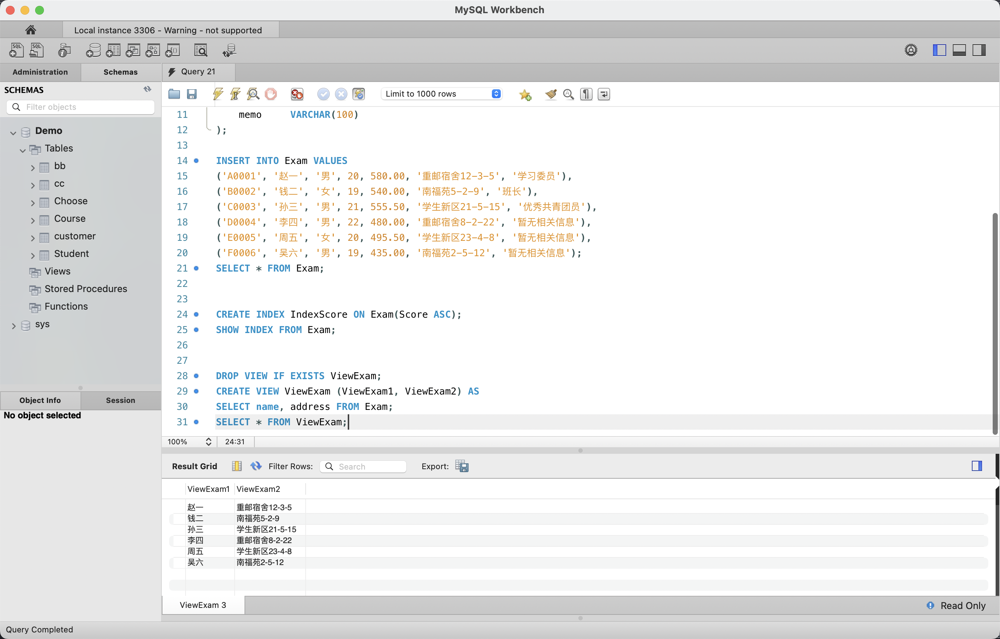
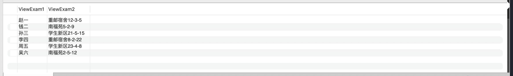
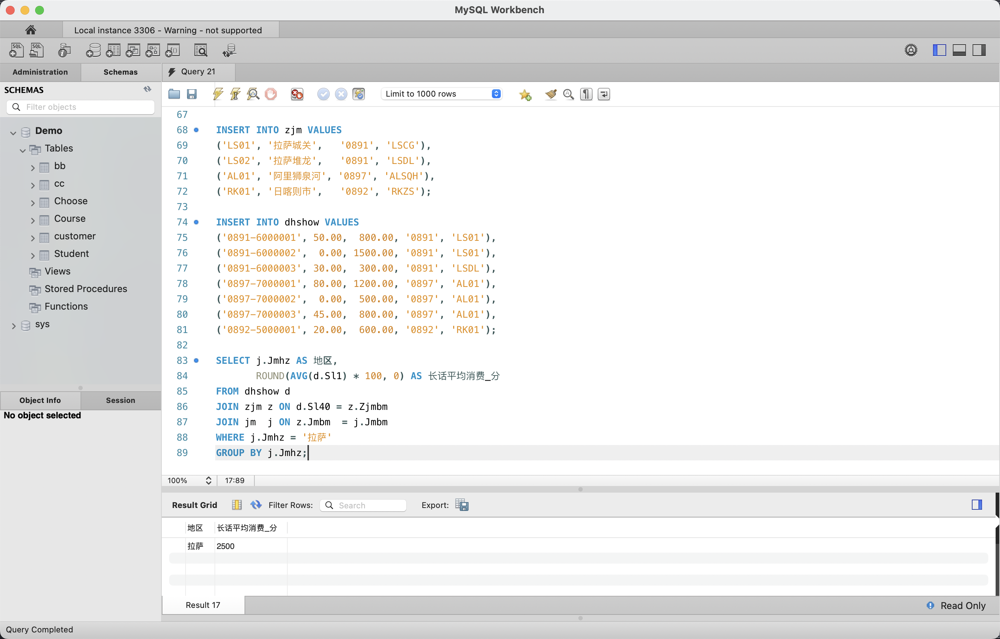
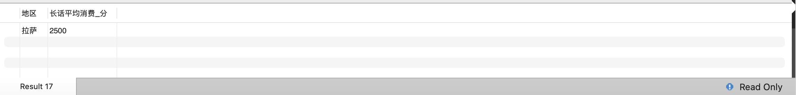
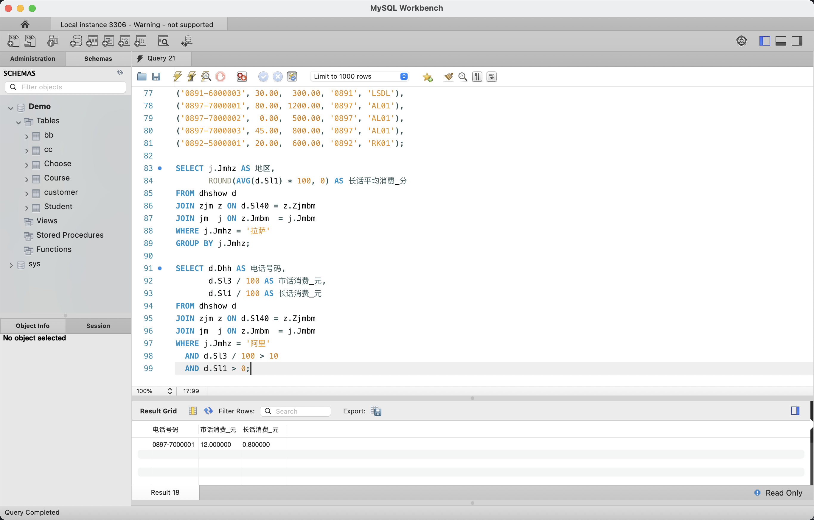
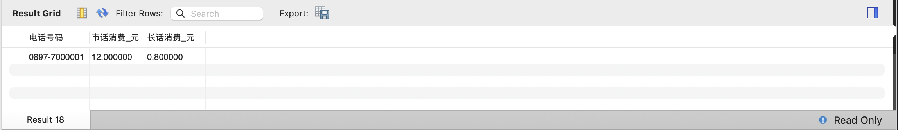

# 实验八：SQL 语言综合练习

## 1. 实验目的

- 通过综合练习巩固 SQL 语言的 DDL、DML、DCL 及多表连接查询
- 复习 `CREATE TABLE`、`INSERT INTO`、`CREATE INDEX`、`CREATE VIEW` 等 DDL 操作
- 练习多表 JOIN 连接查询与聚合统计（`AVG`、`GROUP BY`）
- 初步了解中小型数据库管理系统的需求分析与设计思路

## 2. 实验环境

| 项目 | 配置 |
|------|------|
| 操作系统 | macOS 15（ARM64，Apple Silicon） |
| 数据库 | MySQL Community Server 9.7.0 LTS |
| 管理工具 | MySQL Workbench 8.0（SQL Editor） |

## 3. 与原实验的差异说明

| 原实验（SQL Server 2000） | 本实验（MySQL 9.7）替代方案 |
|--------------------------|---------------------------|
| SQL Server 查询分析器 | MySQL Workbench SQL Editor |
| `integer` 类型 | `INT` |
| `numeric(6,2)` 类型 | `DECIMAL(6, 2)` |
| 外部文件 `jm.sql` / `zjm.sql` / `dhshow.sql` | 文件缺失，根据任务文档中的表结构自行模拟三表及测试数据 |
| `dhshow` 表执行时间长 | MySQL 中数据量小，即时完成 |
| Windows 路径拷贝 | 不适用，直接在 Workbench 中编写 SQL |

## 4. 实验过程

### 4.1 建表 Exam 并插入数据



在 Query 21 编辑器中，执行 `USE Demo;` 切换数据库后，`DROP TABLE IF EXISTS Exam;` 清理旧表。使用 `CREATE TABLE Exam` 创建包含 7 个字段的学生考试表：id（主键）、name、sex、age、score（总成绩，DECIMAL(6,2)）、address、memo（备注）。随后使用 `INSERT INTO Exam VALUES` 批量插入 6 条记录，覆盖赵一到吴六的完整数据。`SELECT * FROM Exam;` 查询确认 6 行数据全部写入。

### 4.2 Exam 表数据展示



Exam 表包含 7 列，6 行数据的详细内容如下：

| id | name | sex | age | score | address | memo |
|----|------|-----|-----|-------|---------|------|
| A0001 | 赵一 | 男 | 20 | 580.00 | 重邮宿舍12-3-5 | 学习委员 |
| B0002 | 钱二 | 女 | 19 | 540.00 | 南福苑5-2-9 | 班长 |
| C0003 | 孙三 | 男 | 21 | 555.50 | 学生新区21-5-15 | 优秀共青团员 |
| D0004 | 李四 | 男 | 22 | 480.00 | 重邮宿舍8-2-22 | 暂无相关信息 |
| E0005 | 周五 | 女 | 20 | 495.50 | 学生新区23-4-8 | 暂无相关信息 |
| F0006 | 吴六 | 男 | 19 | 435.00 | 南福苑2-5-12 | 暂无相关信息 |

### 4.3 创建索引 IndexScore



执行 `CREATE INDEX IndexScore ON Exam(Score ASC);` 在 Exam 表的 Score 字段上建立一个升序索引，以加速按成绩排序的查询。随后执行 `SHOW INDEX FROM Exam;` 查看 Exam 表上的所有索引信息。Result 2 显示了两条索引记录：建表时自动创建的 PRIMARY 索引（id 列，BTREE，唯一索引）和刚创建的 IndexScore（score 列，BTREE，非唯一索引）。

### 4.4 索引详情展示



`SHOW INDEX FROM Exam;` 的详细结果：

| Table | Key_name | Column_name | Non_unique | Index_type | Visible |
|-------|----------|-------------|-----------|------------|---------|
| Exam | PRIMARY | id | 0 | BTREE | YES |
| Exam | IndexScore | score | 1 | BTREE | YES |

PRIMARY 为唯一索引（Non_unique=0），IndexScore 为非唯一索引（Non_unique=1），Cardinality 均为 6，索引类型均为 BTREE（B+树），均对优化器可见。

### 4.5 创建视图 ViewExam



执行 `DROP VIEW IF EXISTS ViewExam;` 清理旧视图后，使用 `CREATE VIEW ViewExam (ViewExam1, ViewExam2) AS SELECT name, address FROM Exam;` 创建视图，将 Exam 表的 name 和 address 列映射为 ViewExam1 和 ViewExam2。随后 `SELECT * FROM ViewExam;` 验证视图内容，Result Grid 显示 6 行数据，包含姓名和地址两列，与源表 Exam 完全对应。

### 4.6 视图数据展示



ViewExam 视图返回了 6 行数据：赵一（重邮宿舍12-3-5）、钱二（南福苑5-2-9）、孙三（学生新区21-5-15）、李四（重邮宿舍8-2-22）、周五（学生新区23-4-8）、吴六（南福苑2-5-12）。视图成功从 Exam 表中提取了姓名和地址两个字段，隐藏了其他列。

### 4.7 模拟 jm / zjm / dhshow 三表及拉萨查询



由于原实验所需的 `jm.sql`、`zjm.sql`、`dhshow.sql` 外部文件缺失，根据任务文档中的表结构自行模拟了三张表及测试数据：

- **jm**（局名表）：拉萨(0891)、阿里(0897)、日喀则(0892)
- **zjm**（子局名表）：4 个子局，通过 Jmbm 关联 jm 表
- **dhshow**（话费表）：7 条通话记录，含长话费(Sl1)、市话费(Sl3)，通过 Sl40 关联 zjm 表

随后执行三表 JOIN 查询，计算拉萨地区长话平均消费。Result 17 显示拉萨长话平均消费为 **2500 分人民币**。

### 4.8 拉萨查询结果



查询拉萨地区长话平均消费的 SQL 逻辑：通过 `dhshow JOIN zjm ON Sl40=Zjmbm JOIN jm ON Jmbm` 三表连接，WHERE 过滤 `Jmhz='拉萨'`，`ROUND(AVG(Sl1)*100, 0)` 将长话费（单位：元）换算为分。结果为拉萨长话平均消费 **2500 分**（即 25.00 元）。

### 4.9 阿里地区筛选查询



执行查询：`SELECT d.Dhh AS 电话号码, d.Sl3/100 AS 市话消费_元, d.Sl1/100 AS 长话消费_元 FROM dhshow d JOIN zjm z ON d.Sl40=z.Zjmbm JOIN jm j ON z.Jmbm=j.Jmbm WHERE j.Jmhz='阿里' AND d.Sl3/100 > 10 AND d.Sl1 > 0;`。该查询筛选阿里地区市话消费大于 10 元且长话消费不为零的电话号码，通过 `/100` 将分转换为元。Result 18 显示符合条件的号码为 `0897-7000001`。

### 4.10 阿里查询结果



阿里地区筛选查询结果仅有 1 条记录满足全部条件：

| 电话号码 | 市话消费_元 | 长话消费_元 |
|----------|-----------|-----------|
| 0897-7000001 | 12.000000 | 0.800000 |

- 0897-7000002 被排除（长话费 Sl1=0，不满足 `d.Sl1>0`）
- 0897-7000003 被排除（市话费 Sl3=800 分=8 元，不满足 `d.Sl3/100>10`）

## 5. SQL 语句汇总

### DDL — 建表

```sql
-- 1. 创建 Exam 表
USE Demo;
DROP TABLE IF EXISTS Exam;
CREATE TABLE Exam (
    id       VARCHAR(17) PRIMARY KEY,
    name     VARCHAR(10),
    sex      VARCHAR(2),
    age      INT,
    score    DECIMAL(6, 2),
    address  VARCHAR(50),
    memo     VARCHAR(100)
);

-- 2. 创建 jm（局名表）
DROP TABLE IF EXISTS jm;
CREATE TABLE jm (
    Jmbm  VARCHAR(10) PRIMARY KEY,
    Jmhz  VARCHAR(30),
    Jmbz  VARCHAR(10)
);

-- 3. 创建 zjm（子局名表）
DROP TABLE IF EXISTS zjm;
CREATE TABLE zjm (
    Zjmbm VARCHAR(10) PRIMARY KEY,
    Zjmhz VARCHAR(30),
    Jmbm  VARCHAR(10),
    Zjmbz VARCHAR(10)
);

-- 4. 创建 dhshow（话费表）
DROP TABLE IF EXISTS dhshow;
CREATE TABLE dhshow (
    Dhh  VARCHAR(15) PRIMARY KEY,
    Sl1  DECIMAL(10, 2),
    Sl3  DECIMAL(10, 2),
    Sl39 VARCHAR(10),
    Sl40 VARCHAR(10)
);
```

### DML — 插入数据

```sql
-- Exam 表
INSERT INTO Exam VALUES
('A0001', '赵一', '男', 20, 580.00, '重邮宿舍12-3-5', '学习委员'),
('B0002', '钱二', '女', 19, 540.00, '南福苑5-2-9', '班长'),
('C0003', '孙三', '男', 21, 555.50, '学生新区21-5-15', '优秀共青团员'),
('D0004', '李四', '男', 22, 480.00, '重邮宿舍8-2-22', '暂无相关信息'),
('E0005', '周五', '女', 20, 495.50, '学生新区23-4-8', '暂无相关信息'),
('F0006', '吴六', '男', 19, 435.00, '南福苑2-5-12', '暂无相关信息');

-- jm 表
INSERT INTO jm VALUES
('0891', '拉萨',   'LS'),
('0897', '阿里',   'AL'),
('0892', '日喀则', 'RKZ');

-- zjm 表
INSERT INTO zjm VALUES
('LS01', '拉萨城关',   '0891', 'LSCG'),
('LS02', '拉萨堆龙',   '0891', 'LSDL'),
('AL01', '阿里狮泉河', '0897', 'ALSQH'),
('RK01', '日喀则市',   '0892', 'RKZS');

-- dhshow 表
INSERT INTO dhshow VALUES
('0891-6000001', 50.00,  800.00, '0891', 'LS01'),
('0891-6000002',  0.00, 1500.00, '0891', 'LS01'),
('0891-6000003', 30.00,  300.00, '0891', 'LSDL'),
('0897-7000001', 80.00, 1200.00, '0897', 'AL01'),
('0897-7000002',  0.00,  500.00, '0897', 'AL01'),
('0897-7000003', 45.00,  800.00, '0897', 'AL01'),
('0892-5000001', 20.00,  600.00, '0892', 'RK01');
```

### 索引

```sql
-- 创建升序索引
CREATE INDEX IndexScore ON Exam(Score ASC);

-- 查看索引
SHOW INDEX FROM Exam;
```

### 视图

```sql
-- 创建视图
DROP VIEW IF EXISTS ViewExam;
CREATE VIEW ViewExam (ViewExam1, ViewExam2) AS
SELECT name, address FROM Exam;

-- 查询视图
SELECT * FROM ViewExam;
```

### DQL — 多表连接查询

```sql
-- 查询：拉萨地区长话平均消费（分）
SELECT j.Jmhz AS 地区,
       ROUND(AVG(d.Sl1) * 100, 0) AS 长话平均消费_分
FROM dhshow d
JOIN zjm z ON d.Sl40 = z.Zjmbm
JOIN jm  j ON z.Jmbm  = j.Jmbm
WHERE j.Jmhz = '拉萨'
GROUP BY j.Jmhz;

-- 查询：阿里地区市话 > 10 元且长话 > 0 的电话号码
SELECT d.Dhh AS 电话号码,
       d.Sl3 / 100 AS 市话消费_元,
       d.Sl1 / 100 AS 长话消费_元
FROM dhshow d
JOIN zjm z ON d.Sl40 = z.Zjmbm
JOIN jm  j ON z.Jmbm  = j.Jmbm
WHERE j.Jmhz = '阿里'
  AND d.Sl3 / 100 > 10
  AND d.Sl1 > 0;
```

## 6. 任务 7 说明 — 小型数据库管理系统设计

实验任务 7 要求完成一个小型数据库管理系统的需求分析、设计及实现。以下简述选题思路：

**选题建议：学生选课成绩管理系统**

该选题与实验三至六中使用过的 Student / Course / Choose 表结构一脉相承，可在已有基础上扩展：

- **需求分析**：学生信息管理、课程信息管理（含先行课约束）、选课与成绩录入、成绩统计查询（按学生/课程/院系维度）、用户权限控制（教师/学生/管理员）
- **ER 图设计**：Student（学生）、Course（课程）、Choose（选课）三个实体，Student-Choose 为 1:N，Course-Choose 为 1:N
- **数据库实现**：DDL 建表 + 外键约束 + 索引优化 + 视图封装常用统计
- **核心代码**：CRUD 存储过程、成绩统计 SQL、先行课冲突检测

由于截图未包含任务 7 的实现过程，详细的需求文档、ER 图和系统设计可另起文档补充。

## 7. 实验结果

| 操作 | 结果 |
|------|------|
| `CREATE TABLE Exam` | 成功，7 个字段定义完整，id 为主键 |
| `INSERT INTO Exam` (6 行) | 成功，SELECT 返回全部 6 行 |
| `CREATE INDEX IndexScore ON Exam(Score ASC)` | 成功，BTREE 索引，Cardinality=6 |
| `CREATE VIEW ViewExam` | 成功，SELECT 返回 6 行（姓名+地址） |
| 模拟 jm / zjm / dhshow 三表 | 成功，jm 3 行、zjm 4 行、dhshow 7 行 |
| 拉萨长话平均消费查询 | 成功，2500 分（25.00 元） |
| 阿里市话 >10 元且长话 >0 查询 | 成功，仅 `0897-7000001` 满足 |

### 八次实验 SQL 知识体系总结

| 实验 | 主题 | 核心知识点 |
|------|------|-----------|
| 实验一 | 安装与配置 | MySQL 安装、服务启停、Workbench 连接 |
| 实验二 | 启动与建库建表 | `mysql.server` 启动、`CREATE DATABASE`、`CREATE TABLE` |
| 实验三 | DML 初步 | `INSERT`、`SELECT`、`WHERE`、`GROUP BY` |
| 实验四 | DDL | `CREATE/DROP TABLE`、`ALTER TABLE ADD`、`CREATE/DROP VIEW`、`CREATE/DROP INDEX` |
| 实验五 | DML 进阶 | `INSERT`、`UPDATE ... SET ... WHERE`、`DELETE FROM ... WHERE` |
| 实验六 | 数据查询 | 简单查询、连接查询（JOIN）、嵌套查询（子查询）、组合查询（INTERSECT 替代） |
| 实验七 | DCL | `CREATE USER`、`GRANT`、`REVOKE`、列级权限控制 |
| 实验八 | 综合练习 | 综合 DDL+DML+DQL+索引+视图+多表连接+聚合统计 |

八个实验覆盖了 SQL 语言的完整知识体系：DDL（数据定义）、DML（数据操纵）、DCL（数据控制）、DQL（数据查询），以及索引、视图等数据库对象的创建与管理，达到了对 SQL 语言"较好掌握"的实验目标。
