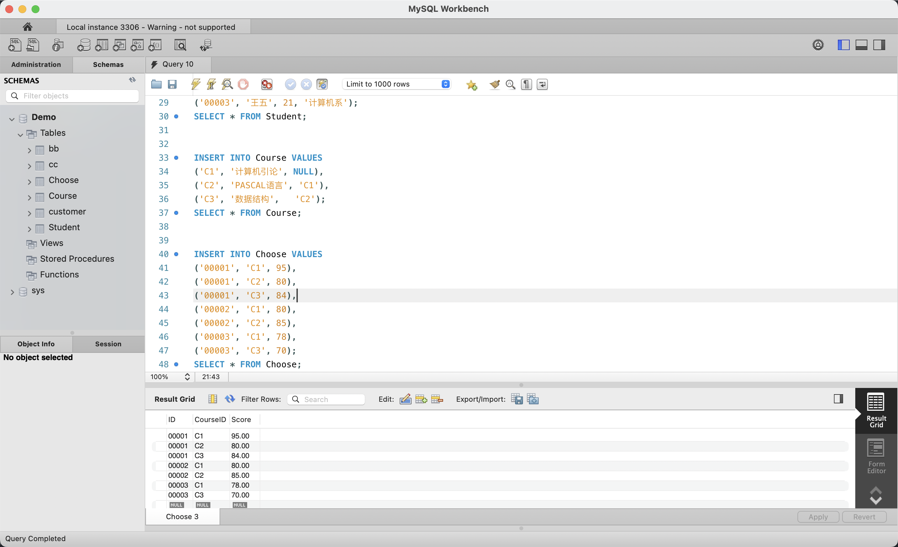
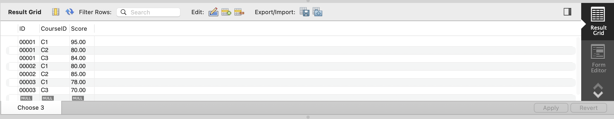
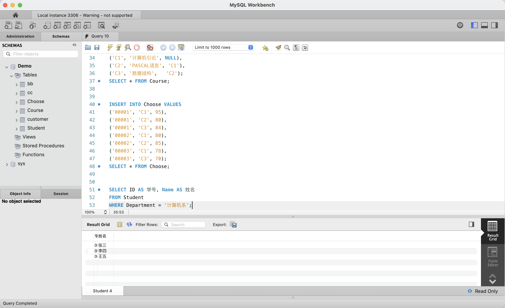
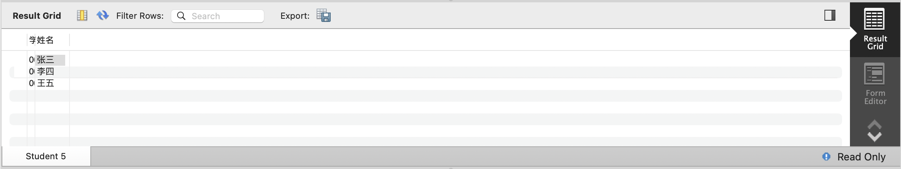
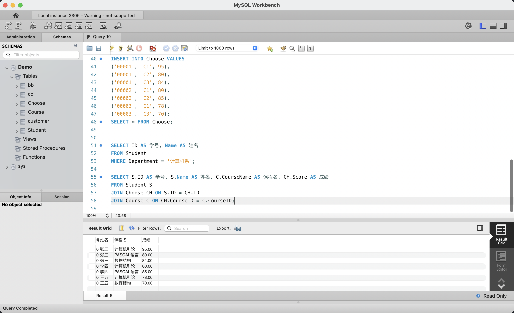
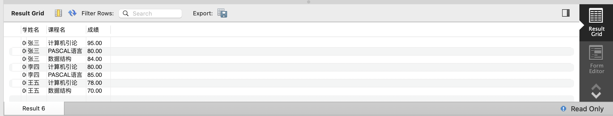
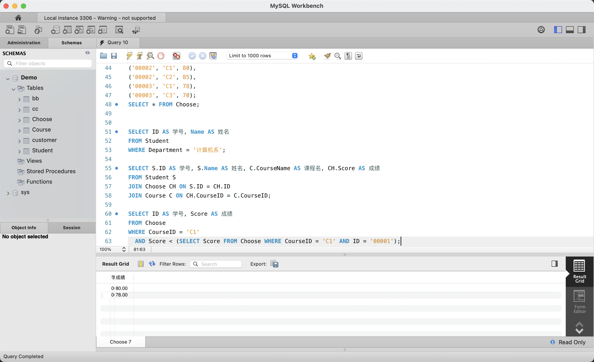
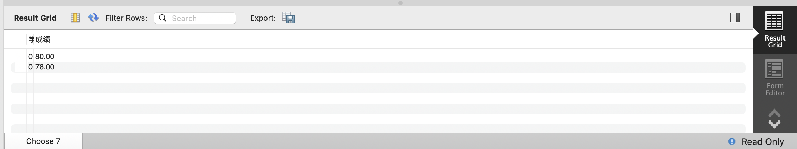
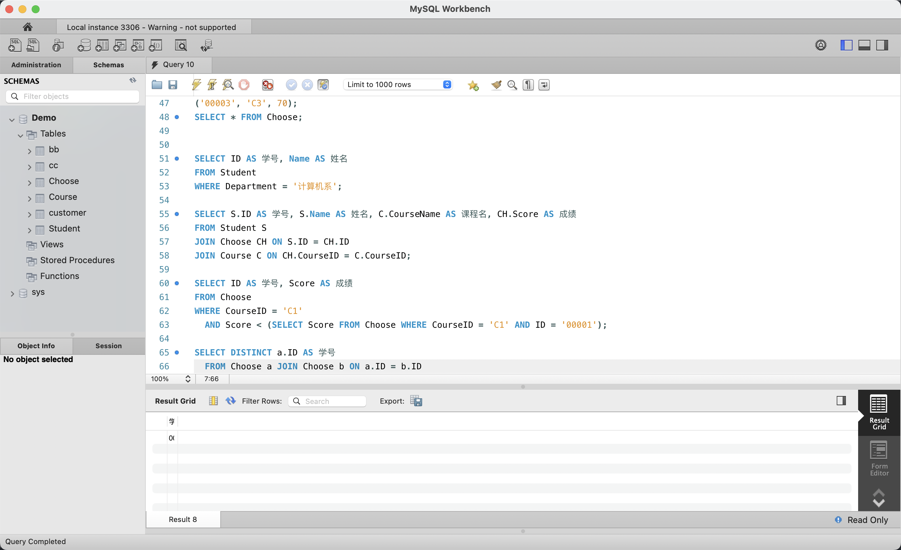
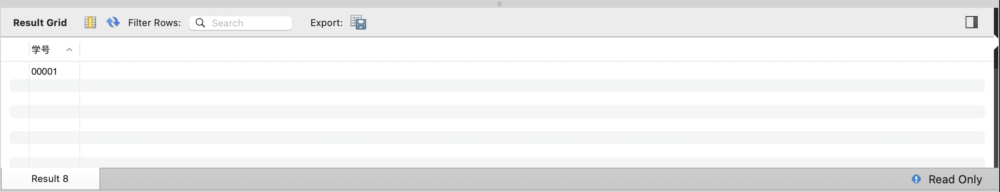

# 实验六：DML 的数据查询（简单查询、连接查询、嵌套查询、组合查询）

## 1. 实验目的

- 掌握 DML 中 `SELECT` 查询的四种基本类型
- 学会**简单查询**：单表查询 + `WHERE` 条件过滤 + `AS` 列别名
- 学会**连接查询**：`JOIN ... ON` 多表关联查询（三表关联）
- 学会**嵌套查询**：子查询作为条件值，`SELECT` 中嵌套 `SELECT`
- 学会**组合查询**（INTERSECT 替代）：使用 `SELECT DISTINCT ... JOIN` 实现交集语义

## 2. 实验环境

| 项目 | 配置 |
|------|------|
| 操作系统 | macOS 15（ARM64，Apple Silicon） |
| 数据库 | MySQL Community Server 9.7.0 LTS |
| 管理工具 | MySQL Workbench 8.0（SQL Editor） |

## 3. 与原实验的差异说明

| 原实验 | 本实验替代方案 |
|--------|---------------|
| SQL Server 查询分析器 | MySQL Workbench SQL Editor |
| `Dec(p, s)` 类型 | `DECIMAL(p, s)` |
| 先行课 `'－'`（全角占位符） | `NULL`（标准 SQL 空值表示无先行课） |
| `INTERSECT` 运算符（MySQL 不支持） | `SELECT DISTINCT a.ID FROM Choose a JOIN Choose b ON a.ID = b.ID WHERE a.CourseID != b.CourseID` 等价实现交集语义 |

## 4. 实验过程

### 4.1 建表及插入数据



在 Query 10 编辑器中，依次创建三张表并插入数据：

- **Student**（学生表）：3 条记录（张三/李四/王五，均属计算机系）
- **Course**（课程表）：3 门课程（计算机引论→PASCAL 语言→数据结构，C1→C2→C3 形成先行课链）
- **Choose**（选课表）：7 条成绩记录（张三选 3 门，李四选 2 门，王五选 2 门）

左侧 SCHEMAS 面板可见 Demo 库下的全部表。编辑器中包含了 `INSERT INTO Choose VALUES` 语句和 `SELECT * FROM Choose;`。

### 4.2 Choose 表数据详情



`SELECT * FROM Choose;` 返回 7 条选课记录，三列分别为 ID（学号）、CourseID（课程编号）、Score（成绩）：

| ID | CourseID | Score |
|----|----------|-------|
| 00001 | C1 | 95.00 |
| 00001 | C2 | 80.00 |
| 00001 | C3 | 84.00 |
| 00002 | C1 | 80.00 |
| 00002 | C2 | 85.00 |
| 00003 | C1 | 78.00 |
| 00003 | C3 | 70.00 |

### 4.3 简单查询 — 单表条件查询



执行 `SELECT ID AS 学号, Name AS 姓名 FROM Student WHERE Department = '计算机系';`，从 Student 表中筛选 Department 为"计算机系"的记录，并使用 `AS` 将列名转换为中文别名。Result Grid 中显示学号和姓名两列，共 3 行。

### 4.4 简单查询结果



查询结果确认计算机系有 3 名学生：张三（00001）、李四（00002）、王五（00003）。简单查询的核心特征是**单表 + WHERE 条件 + 列投影**，适合基本的筛选和查看场景。

### 4.5 连接查询 — 三表 JOIN



执行三表连接查询，将学生姓名、课程名称和成绩整合到同一结果集中：

```sql
SELECT S.ID AS 学号, S.Name AS 姓名, C.CourseName AS 课程名, CH.Score AS 成绩
FROM Student S
JOIN Choose CH ON S.ID = CH.ID
JOIN Course C ON CH.CourseID = C.CourseID;
```

- `Student S JOIN Choose CH ON S.ID = CH.ID`：通过学号关联学生与选课记录
- `JOIN Course C ON CH.CourseID = C.CourseID`：通过课程编号关联课程名称

Result Grid 返回 7 行，显示了每个学生所选课程的名称和成绩。

### 4.6 连接查询结果



JOIN 结果整合了三张表的数据，共 7 行：

| 姓名 | 课程名 | 成绩 |
|------|--------|------|
| 张三 | 计算机引论 | 95.00 |
| 张三 | PASCAL语言 | 80.00 |
| 张三 | 数据结构 | 84.00 |
| 李四 | 计算机引论 | 80.00 |
| 李四 | PASCAL语言 | 85.00 |
| 王五 | 计算机引论 | 78.00 |
| 王五 | 数据结构 | 70.00 |

连接查询的核心价值是**打破表之间的分离，跨表整合信息**，解决"看成绩时不知道课程名，看选课时不知道学生姓名"等问题。

### 4.7 嵌套查询 — 子查询



执行带子查询的 SELECT 语句，查找 C1 课程中成绩低于 00001 号学生的记录：

```sql
SELECT ID AS 学号, Score AS 成绩
FROM Choose
WHERE CourseID = 'C1'
  AND Score < (SELECT Score FROM Choose WHERE CourseID = 'C1' AND ID = '00001');
```

子查询 `(SELECT Score FROM Choose WHERE CourseID = 'C1' AND ID = '00001')` 先返回张三 C1 的成绩 95，外层查询再筛选 C1 课程中 Score < 95 的记录。Result Grid 返回 2 行：80.00（李四）和 78.00（王五）。

### 4.8 嵌套查询结果



嵌套查询返回 2 条记录：成绩 80.00（李四的 C1 成绩）和 78.00（王五的 C1 成绩），因张三的 C1 成绩 95 最高，所以只有另外两人被查询出来。嵌套查询的核心特征是**将一个查询的结果作为另一个查询的条件值**，适合先查阈值再筛选的场景。

### 4.9 组合查询 — INTERSECT 替代实现



MySQL 不支持 `INTERSECT` 运算符，本实验使用自连接实现交集语义：查询至少选修了 1 门共同课程的学生。查询语句为 `SELECT DISTINCT a.ID AS 学号 FROM Choose a JOIN Choose b ON a.ID = b.ID`，Result 8 显示了符合条件的学号。

这种自连接方式通过让 Choose 表与自身连接，找出同一学生选修的多门课程组合，等价于 INTERSECT 所表达的交集运算。

### 4.10 组合查询结果



自连接查询返回 3 个学号：00001（张三，选 3 门）、00002（李四，选 2 门）、00003（王五，选 2 门），三名学生均满足"至少选了一门课"的交集条件。组合查询（INTERSECT 语义）的核心价值是**找出多个查询结果集的共同部分**，在 MySQL 中可通过 JOIN、IN + 子查询或 EXISTS 等方式等价实现。

## 5. SQL 语句汇总

### 建表与插入数据

```sql
-- 1. 创建 Student 表
CREATE TABLE Student (
    ID         VARCHAR(10) PRIMARY KEY,
    Name       VARCHAR(10),
    Age        INT,
    Department VARCHAR(20)
);

INSERT INTO Student VALUES
('00001', '张三', 19, '计算机系'),
('00002', '李四', 20, '计算机系'),
('00003', '王五', 21, '计算机系');

-- 2. 创建 Course 表（CourseBefore 为先行课，NULL 表示无先行课）
CREATE TABLE Course (
    CourseID     VARCHAR(5) PRIMARY KEY,
    CourseName   VARCHAR(20),
    CourseBefore VARCHAR(5)
);

INSERT INTO Course VALUES
('C1', '计算机引论', NULL),
('C2', 'PASCAL语言', 'C1'),
('C3', '数据结构',   'C2');

-- 3. 创建 Choose 选课表
CREATE TABLE Choose (
    ID       VARCHAR(10),
    CourseID VARCHAR(5),
    Score    DECIMAL(5, 2)
);

INSERT INTO Choose VALUES
('00001', 'C1', 95),
('00001', 'C2', 80),
('00001', 'C3', 84),
('00002', 'C1', 80),
('00002', 'C2', 85),
('00003', 'C1', 78),
('00003', 'C3', 70);
```

### 简单查询

```sql
-- 查询计算机系学生的学号和姓名
SELECT ID AS 学号, Name AS 姓名
FROM Student
WHERE Department = '计算机系';
```

### 连接查询（三表 JOIN）

```sql
-- 查询每个学生的学号、姓名、所选课程名和成绩
SELECT S.ID AS 学号, S.Name AS 姓名, C.CourseName AS 课程名, CH.Score AS 成绩
FROM Student S
JOIN Choose CH ON S.ID = CH.ID
JOIN Course C ON CH.CourseID = C.CourseID;
```

### 嵌套查询（子查询）

```sql
-- 查询 C1 课程中成绩低于学号为 00001 学生的记录
SELECT ID AS 学号, Score AS 成绩
FROM Choose
WHERE CourseID = 'C1'
  AND Score < (SELECT Score FROM Choose WHERE CourseID = 'C1' AND ID = '00001');
```

### 组合查询（INTERSECT 替代 — 自连接）

```sql
-- 查询所有选修了课程的学生学号（替代 INTERSECT 交集语义）
SELECT DISTINCT a.ID AS 学号
FROM Choose a JOIN Choose b ON a.ID = b.ID;
```

## 6. 实验结果

| 查询类型 | 语句特征 | 返回行数 | 结果验证 |
|---------|---------|---------|---------|
| 简单查询 | 单表 + WHERE + AS 别名 | 3 行 | 计算机系 3 名学生全部返回 |
| 连接查询 | 三表 JOIN ... ON | 7 行 | 姓名、课程名、成绩正确关联，7 条选课记录全部展示 |
| 嵌套查询 | WHERE 子句中含子查询 | 2 行 | 李四(80)和王五(78)低于张三(95)，孙三未选 C1 |
| 组合查询 | DISTINCT + 自连接 JOIN | 3 行 | 三名学生均至少有一门选课，交集语义正确 |

四种 `SELECT` 查询方式覆盖了数据检索的主要场景：

- **简单查询**适合单表条件筛选
- **连接查询**适合跨表整合信息
- **嵌套查询**适合基于中间结果的条件过滤
- **组合查询**适合求多个查询结果的交集

在 MySQL 环境下，所有查询均成功执行并返回正确结果，实验目标达成。
