# 实验四：SQL 语言的 DDL（数据定义语言）

## 1. 实验目的

- 掌握 SQL DDL（Data Definition Language）的基本操作
- 学会使用 `CREATE TABLE` / `DROP TABLE` 创建和删除表
- 学会使用 `ALTER TABLE` 修改表结构（添加字段）
- 学会使用 `CREATE VIEW` / `DROP VIEW` 创建和删除视图
- 学会使用 `CREATE INDEX` / `DROP INDEX` 创建和删除索引
- 掌握 `DESC`、`SHOW TABLES`、`SHOW INDEX` 等元数据查看命令

## 2. 实验环境

| 项目 | 配置 |
|------|------|
| 操作系统 | macOS 15（ARM64，Apple Silicon） |
| 数据库 | MySQL Community Server 9.7.0 LTS |
| 管理工具 | MySQL Workbench 8.0（SQL Editor） |

## 3. 与原实验的差异说明

原实验使用 SQL Server 2000 的查询分析器执行 DDL 语句。本实验采用 MySQL Workbench SQL Editor 作为替代。

| 原实验操作 | 本实验替代方案 |
|-----------|---------------|
| SQL Server 查询分析器 | MySQL Workbench SQL Editor |
| `Dec(p, s)` 类型 | `DECIMAL(p, s)`（MySQL 标准写法） |
| `DESC`（SQL Server 无此命令） | `DESC 表名`（MySQL 特有快捷命令） |
| `CREATE TABLE` / `ALTER TABLE` / `CREATE VIEW` / `CREATE INDEX` | 语法兼容，无需修改 |
| `DROP TABLE` / `DROP VIEW` / `DROP INDEX` | 语法兼容，`IF EXISTS` 为 MySQL 增强特性 |

## 4. 实验过程

### 4.1 创建表 aa 并查看结构

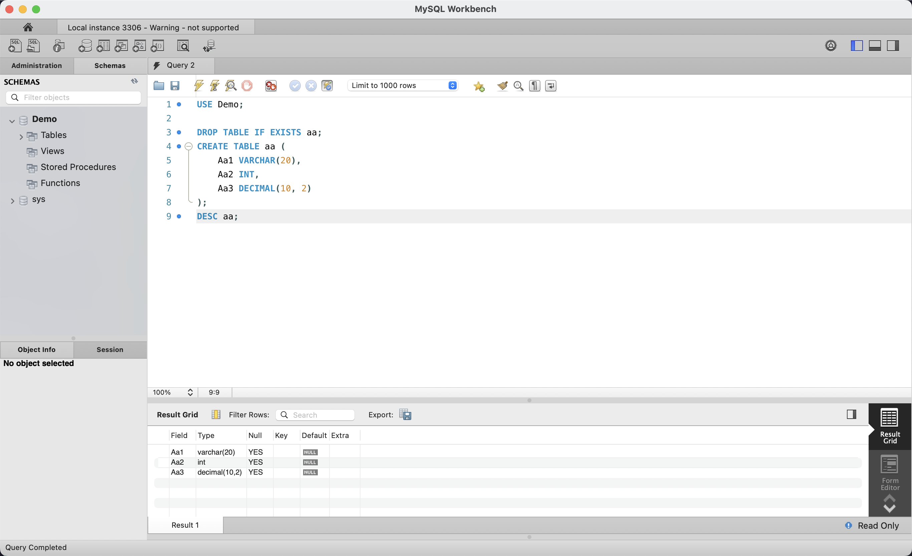

切换到 Demo 数据库后，执行 `DROP TABLE IF EXISTS aa;` 清理旧表，然后使用 `CREATE TABLE aa` 创建名为 aa 的表，包含三个字段：`Aa1 VARCHAR(20)`、`Aa2 INT`、`Aa3 DECIMAL(10, 2)`。执行 `DESC aa;` 查看表结构，Result Grid 显示三个字段的类型定义和默认值（NULL）。

### 4.2 表 aa 结构详情

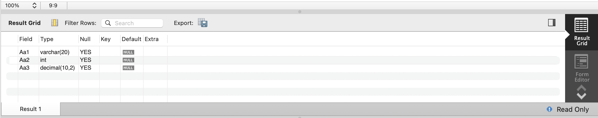

`DESC aa;` 的完整结果如下：

| Field | Type | Null | Key | Default |
|-------|------|------|-----|---------|
| Aa1 | varchar(20) | YES | — | NULL |
| Aa2 | int | YES | — | NULL |
| Aa3 | decimal(10,2) | YES | — | NULL |

三个字段均允许为空，未设置主键，Default 均为 NULL。

### 4.3 创建表 bb 并查看结构

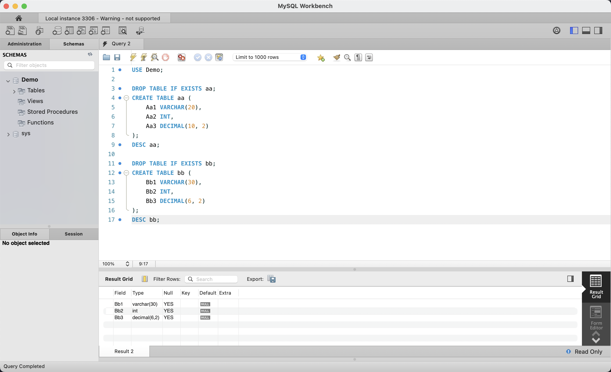

继续编写 `DROP TABLE IF EXISTS bb;` 和 `CREATE TABLE bb` 语句，创建包含 `Bb1 VARCHAR(30)`、`Bb2 INT`、`Bb3 DECIMAL(6, 2)` 三个字段的 bb 表。编辑器中同时可见前面的 aa 表脚本，`DESC bb;` 的 Result 2 面板显示了 bb 表的三字段结构。

### 4.4 表 bb 结构详情

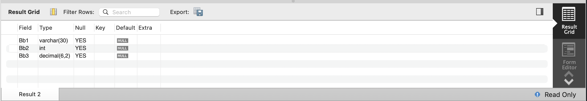

bb 表结构：`Bb1` 为 varchar(30)，`Bb2` 为 int，`Bb3` 为 decimal(6,2)。与 aa 表的区别在于字符串字段长度（30 vs 20）和小数精度（6,2 vs 10,2），三个字段同样允许为空。

### 4.5 删除表 aa 并查看数据库中的表

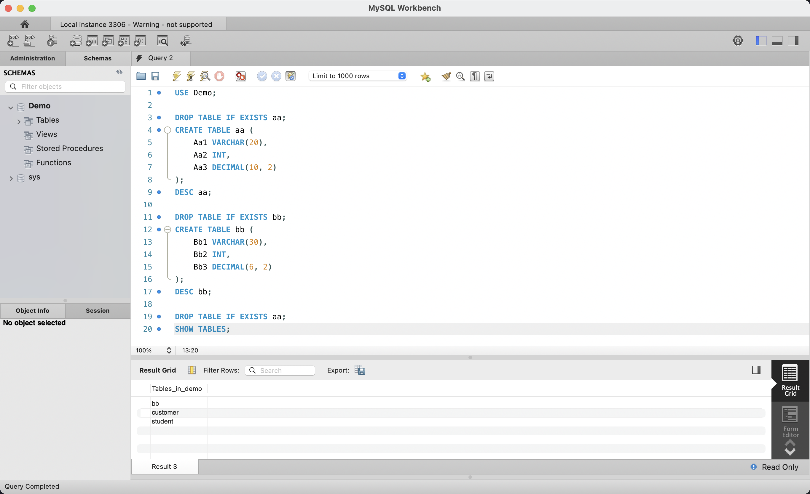

执行 `DROP TABLE IF EXISTS aa;` 删除 aa 表，随后执行 `SHOW TABLES;` 列出当前 Demo 数据库中的所有表。Result 3 显示仅剩 `bb`、`customer`、`student` 三个表，aa 已被成功删除，证明了 `DROP TABLE` 操作的有效性。

### 4.6 当前数据库表列表

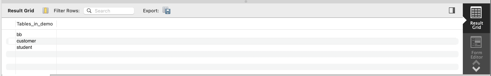

`SHOW TABLES;` 的结果清楚地展示了 Demo 数据库中的三张表：`bb`（刚创建）、`customer`（实验二创建）和 `student`（实验三创建）。aa 表已不存在，确认删除操作成功。

### 4.7 ALTER TABLE — 添加字段

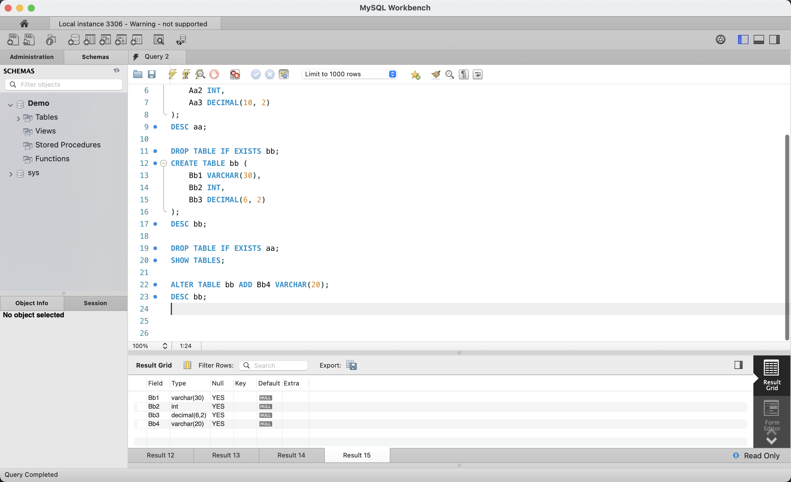

执行 `ALTER TABLE bb ADD Bb4 VARCHAR(20);` 向 bb 表中添加一个名为 `Bb4` 的新字段（VARCHAR 类型，最大长度 20）。随后通过 `DESC bb;` 验证修改结果。Result 15 显示表 bb 现在有 4 个字段，新增的 `Bb4` 显示在最后一行。该操作展示了 `ALTER TABLE ... ADD` 的典型用法。

### 4.8 修改后的表 bb 结构

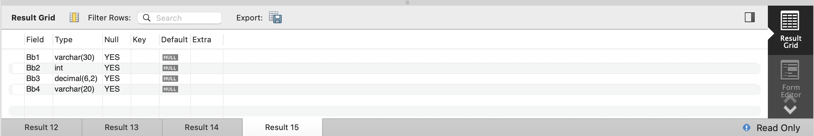

ALTER 后的 bb 表结构包含 4 个字段：`Bb1`(varchar 30)、`Bb2`(int)、`Bb3`(decimal 6,2)、`Bb4`(varchar 20)。所有字段允许为空，默认值均为 NULL，确认字段新增成功。

### 4.9 创建视图 Viewbb

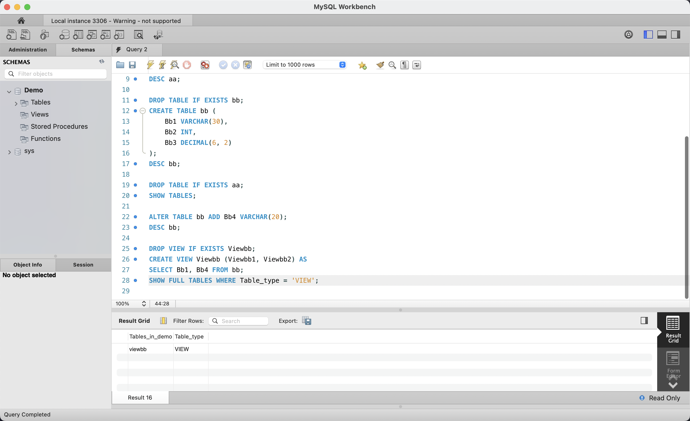

执行 `DROP VIEW IF EXISTS Viewbb;` 清理旧视图后，使用 `CREATE VIEW Viewbb (Viewbb1, Viewbb2) AS SELECT Bb1, Bb4 FROM bb;` 创建视图，从 bb 表中选择 Bb1 和 Bb4 两列作为视图的数据源。随后通过 `SHOW FULL TABLES WHERE Table_type = 'VIEW';` 查询数据库中类型为 VIEW 的对象，Result 16 显示 `viewbb` 类型为 `VIEW`。

### 4.10 视图 Viewbb 验证

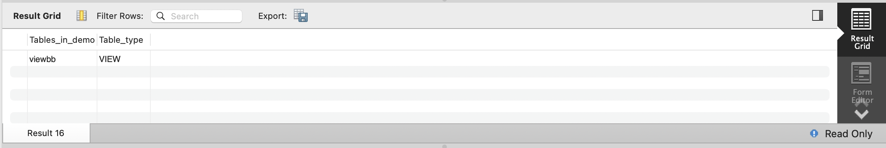

`SHOW FULL TABLES WHERE Table_type = 'VIEW'` 的结果确认为：`viewbb` 的类型为 `VIEW`，证明视图创建成功。该命令为 MySQL 特有的视图查询方式，等效于查询 `information_schema.views`。

### 4.11 删除视图、创建索引

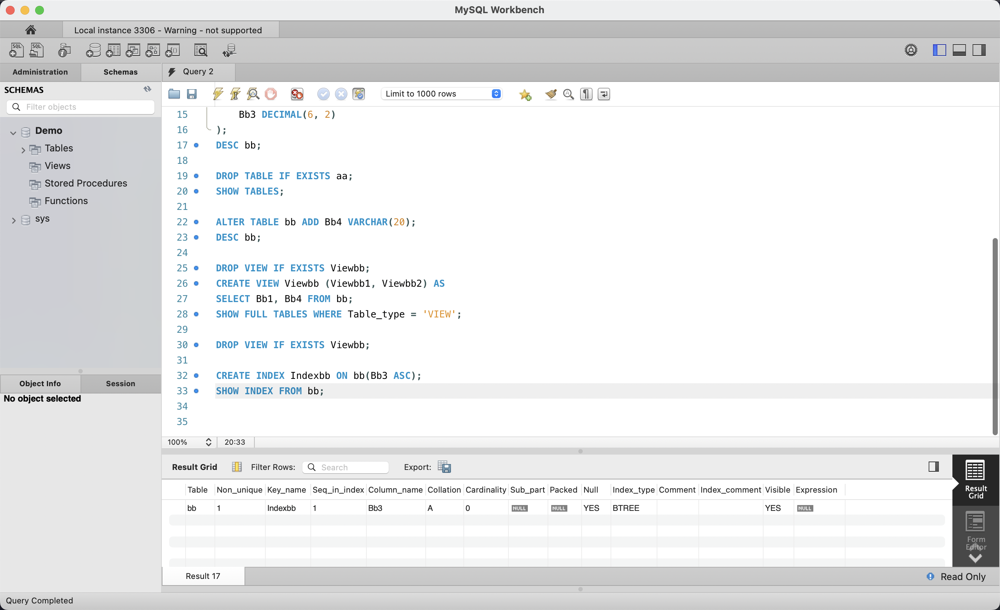

先执行 `DROP VIEW IF EXISTS Viewbb;` 删除刚创建的视图。接着执行 `CREATE INDEX Indexbb ON bb(Bb3 ASC);` 在 bb 表的 Bb3 字段上创建一个升序索引 Indexbb。最后执行 `SHOW INDEX FROM bb;` 查看 bb 表上的索引信息。Result 17 显示 Indexbb 已创建成功：Non_unique=1（允许重复）、Column_name=Bb3、Index_type=BTREE。

### 4.12 索引 Indexbb 详情

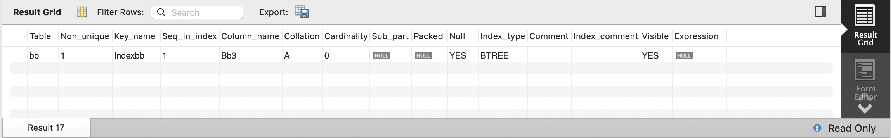

`SHOW INDEX FROM bb;` 返回的索引详情：Table 为 `bb`，Key_name 为 `Indexbb`，Column_name 为 `Bb3`，Collation 为 `A`（升序），Index_type 为 `BTREE`（B+树索引），Visible 为 `YES`（对优化器可见）。这是标准的 MySQL 二级索引结构。

### 4.13 删除索引 Indexbb

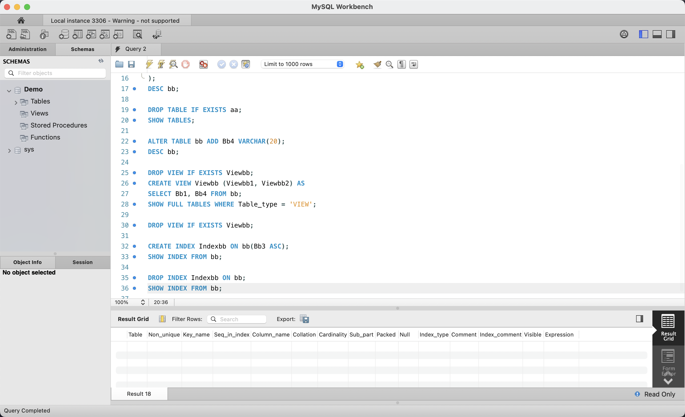

执行 `DROP INDEX Indexbb ON bb;` 删除 Indexbb 索引，随后再次执行 `SHOW INDEX FROM bb;` 验证删除结果。Result 18 显示结果为空（无数据行），证明索引已被成功删除，bb 表上不再有任何自定义索引。

### 4.14 删除索引后验证

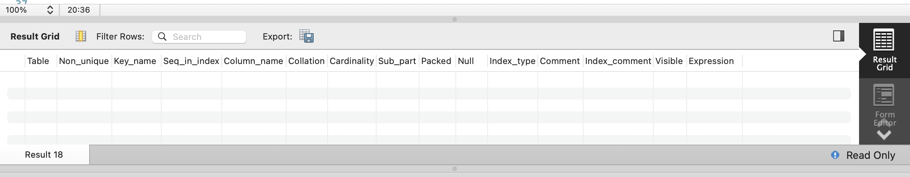

`SHOW INDEX FROM bb;` 的结果区域空白无数据行。Table、Non_unique、Key_name 等列头仍在，但没有任何索引记录，确认 Indexbb 已被完全删除。至此，本次 DDL 实验从建表到删索引的完整流程结束。

## 5. SQL 语句汇总

```sql
-- 切换到 Demo 数据库
USE Demo;

-- ========== 表操作 ==========

-- 1. 创建表 aa
DROP TABLE IF EXISTS aa;
CREATE TABLE aa (
    Aa1 VARCHAR(20),
    Aa2 INT,
    Aa3 DECIMAL(10, 2)
);
DESC aa;

-- 2. 创建表 bb
DROP TABLE IF EXISTS bb;
CREATE TABLE bb (
    Bb1 VARCHAR(30),
    Bb2 INT,
    Bb3 DECIMAL(6, 2)
);
DESC bb;

-- 3. 删除表 aa
DROP TABLE IF EXISTS aa;
SHOW TABLES;

-- 4. 修改表 bb：添加字段 Bb4
ALTER TABLE bb ADD Bb4 VARCHAR(20);
DESC bb;

-- ========== 视图操作 ==========

-- 5. 创建视图 Viewbb
DROP VIEW IF EXISTS Viewbb;
CREATE VIEW Viewbb (Viewbb1, Viewbb2) AS
SELECT Bb1, Bb4 FROM bb;
SHOW FULL TABLES WHERE Table_type = 'VIEW';

-- 6. 删除视图 Viewbb
DROP VIEW IF EXISTS Viewbb;

-- ========== 索引操作 ==========

-- 7. 创建索引 Indexbb（在 bb 表的 Bb3 列上，升序）
CREATE INDEX Indexbb ON bb(Bb3 ASC);
SHOW INDEX FROM bb;

-- 8. 删除索引 Indexbb
DROP INDEX Indexbb ON bb;
SHOW INDEX FROM bb;
```

## 6. 实验结果

| 操作 | 语句 | 结果 |
|------|------|------|
| 建表 aa | `CREATE TABLE aa (...)` | 成功，DESC 显示 3 字段 |
| 建表 bb | `CREATE TABLE bb (...)` | 成功，DESC 显示 3 字段 |
| 删表 aa | `DROP TABLE aa` | 成功，SHOW TABLES 仅含 bb, customer, student |
| 修改表 | `ALTER TABLE bb ADD Bb4` | 成功，DESC bb 显示 4 字段 |
| 建视图 | `CREATE VIEW Viewbb AS SELECT` | 成功，SHOW FULL TABLES 确认 Viewbb (VIEW) |
| 删视图 | `DROP VIEW Viewbb` | 成功 |
| 建索引 | `CREATE INDEX Indexbb ON bb(Bb3 ASC)` | 成功，SHOW INDEX 显示 BTREE 索引 |
| 删索引 | `DROP INDEX Indexbb ON bb` | 成功，SHOW INDEX 返回空结果 |

全部 DDL 操作均执行成功：CREATE TABLE（2 张表）、DROP TABLE（1 张表）、ALTER TABLE（添加 1 列）、CREATE VIEW / DROP VIEW（各 1 次）、CREATE INDEX / DROP INDEX（各 1 次）。每步操作均通过相应的元数据查询命令验证，结果符合预期。
