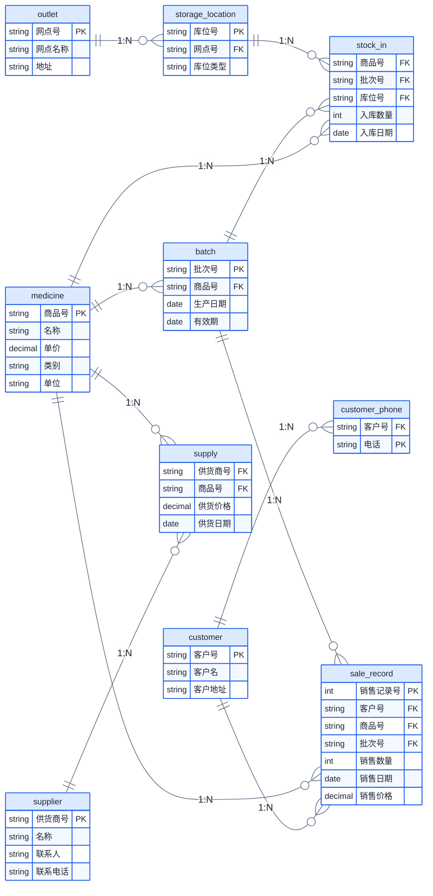

# 数据库原理 2020 B卷 参考答案

## 一、关系代数计算题（每小题2分，共10分）

已知关系R：

| A | B | C |
|:-:|:-:|:-:|
| 2 | 3 | 4 |
| 2 | 3 | 5 |
| 3 | 2 | 3 |
| 2 | 3 | 3 |
| 4 | 2 | 3 |

关系S：

| B | C |
|:-:|:-:|
| 3 | 3 |
| 3 | 5 |

### 1. $\pi_{A,B}(R)$

投影到A、B列，去重后：

| A | B |
|:-:|:-:|
| 2 | 3 |
| 3 | 2 |
| 4 | 2 |

### 2. $\sigma_{R.C=S.C}(R \times S)$

先计算笛卡尔积（5×2=10元组），选择R.C=S.C的元组：

| R.A | R.B | R.C | S.B | S.C |
|:---:|:---:|:---:|:---:|:---:|
| 2 | 3 | 5 | 3 | 5 |
| 3 | 2 | 3 | 3 | 3 |
| 2 | 3 | 3 | 3 | 3 |
| 4 | 2 | 3 | 3 | 3 |

### 3. $\sigma_{A='3' \lor B='3'}(R)$

选择A='3'或B='3'的元组：

| A | B | C |
|:-:|:-:|:-:|
| 2 | 3 | 4 |
| 2 | 3 | 5 |
| 3 | 2 | 3 |
| 2 | 3 | 3 |

### 4. $R \div S$

除法定义：$R \div S = \{ t[A] \mid \forall t_s \in S,\; \exists t_r \in R,\; t_r[B,C] = t_s \land t_r[A] = t[A] \}$

对于每个A值，检查其$(B,C)$集合是否包含S的所有元组$\{(3,3), (3,5)\}$：

- **$A=2$**: $\pi_{B,C}(\sigma_{A=2}(R)) = \{(3,4), (3,5), (3,3)\}$，包含 $\checkmark$
- **$A=3$**: $\pi_{B,C}(\sigma_{A=3}(R)) = \{(2,3)\}$，不包含 $\times$
- **$A=4$**: $\pi_{B,C}(\sigma_{A=4}(R)) = \{(2,3)\}$，不包含 $\times$

**结果**: $\{2\}$

### 5. $R \bowtie S$（自然连接）

在公共属性B、C上等值连接：

| A | B | C |
|:-:|:-:|:-:|
| 2 | 3 | 5 |
| 2 | 3 | 3 |

---

## 二、关系代数与关系演算（每小题4分，共12分）

关系模式：
- Student(Sno, Sname, Sage, Ssex, Sdept)
- Course(Cno, Cname, Cpno)
- SC(Sno, Cno, Grade)

### 1. 查询李勇同学选修的所有课程的课程名

**关系代数**：
$\pi_{Cname}(\sigma_{Sname='李勇'}(Student \bowtie SC \bowtie Course))$

**ALPHA语言**：
$\text{GET W (Course.Cname)}: \exists \text{SC} (\text{Student.Sno} = \text{SC.Sno} \land \text{SC.Cno} = \text{Course.Cno} \land \text{Student.Sname} = \text{'李勇'})$

### 2. 查询既选修了1号课程又选修了2号课程的学生的学号和姓名

**关系代数**：
$\pi_{Sno,Sname}(Student \bowtie (\pi_{Sno}(\sigma_{Cno='1'}(SC)) \cap \pi_{Sno}(\sigma_{Cno='2'}(SC))))$

**ALPHA语言**：
$\text{GET W (Student.Sno, Student.Sname)}: \exists \text{SC1} \exists \text{SC2} (\text{SC1.Sno} = \text{Student.Sno} \land \text{SC1.Cno} = \text{'1'} \land \text{SC2.Sno} = \text{Student.Sno} \land \text{SC2.Cno} = \text{'2'})$

### 3. 查询至少选修2门不同课程的学生的学号和姓名

**关系代数**：
令 $SC1 = \rho_{Sno1, Cno1, Grade1}(SC)$, $SC2 = \rho_{Sno2, Cno2, Grade2}(SC)$
$\pi_{Sno, Sname}(Student \bowtie \pi_{Sno1}(\sigma_{Sno1=Sno2 \land Cno1 \neq Cno2}(SC1 \times SC2)))$

**ALPHA语言**：
$\text{GET W (Student.Sno, Student.Sname)}: \exists \text{SC1} \exists \text{SC2} (\text{SC1.Sno} = \text{Student.Sno} \land \text{SC2.Sno} = \text{Student.Sno} \land \text{SC1.Cno} \neq \text{SC2.Cno})$

---

## 三、SQL语言（每小题3分，共18分）

关系模式：emp(empno, ename, job, mgr, hiredate, sal, comm, deptno), dept(deptno, dname, loc)

### 1. 查询在ACCOUNTING部门工作的雇员的雇员号和雇员名

```sql
SELECT empno, ename
FROM emp
WHERE deptno = (SELECT deptno FROM dept WHERE dname = 'ACCOUNTING');
```

或等值连接：
```sql
SELECT empno, ename
FROM emp JOIN dept ON emp.deptno = dept.deptno
WHERE dname = 'ACCOUNTING';
```

### 2. 查询比FORD雇佣时间长的雇员的雇员号和雇员名

```sql
SELECT empno, ename
FROM emp
WHERE hiredate < (SELECT hiredate FROM emp WHERE ename = 'FORD');
```

### 3. 查询比他（她）的经理工资高的雇员的雇员号、雇员名以及工资

```sql
SELECT e.empno, e.ename, e.sal
FROM emp e JOIN emp m ON e.mgr = m.empno
WHERE e.sal > m.sal;
```

### 4. 查询雇佣人数最多的部门的部门号和部门名

```sql
SELECT deptno, dname
FROM (SELECT d.deptno, d.dname, COUNT(*) AS cnt
      FROM emp e JOIN dept d ON e.deptno = d.deptno
      GROUP BY d.deptno, d.dname)
WHERE cnt = (SELECT MAX(COUNT(*)) FROM emp GROUP BY deptno);
```

### 5. 建立"ACCOUNTING"部门的雇员视图 empv(empno, ename, salary)

```sql
CREATE VIEW empv(empno, ename, salary) AS
SELECT empno, ename, sal
FROM emp
WHERE deptno = (SELECT deptno FROM dept WHERE dname = 'ACCOUNTING');
```

### 6. 将"ACCOUNTING"部门所有雇员的工资增加1500元

```sql
UPDATE emp
SET sal = sal + 1500
WHERE deptno = (SELECT deptno FROM dept WHERE dname = 'ACCOUNTING');
```

---

## 四、关系数据理论（20分）

### 1. 关系模式 R(U, F)，U=ABCD，F={AB→C, C→D, D→B}

#### (1) 计算 $(AB)_F^+$ 和 $(AC)_F^+$

**$(AB)_F^+$**:
- 初始: {A, B}
- AB→C: 加入C → {A, B, C}
- C→D: 加入D → {A, B, C, D}
- D→B: B已有
- 结果: $(AB)_F^+$ = **{A, B, C, D} = U**，AB是超码

**$(AC)_F^+$**:
- 初始: {A, C}
- C→D: 加入D → {A, C, D}
- D→B: 加入B → {A, B, C, D}
- 结果: $(AC)_F^+$ = **{A, B, C, D} = U**，AC也是超码

#### (2) 求R的所有候选码，并说明理由

对属性分类：L = {A}（仅左部），LR = {B, C, D}（左右均出现）。core = {A}，A⁺ = {A} ≠ U。

从 LR 逐个添加试：
- AB: (AB)⁺ = ABCD = U，极小（A⁺≠U, B⁺≠U）→ **候选码**
- AC: (AC)⁺ = ACBD = U，极小（A⁺≠U, C⁺={C,D,B}≠U）→ **候选码**
- AD: (AD)⁺ = ADBC = U，极小（A⁺≠U, D⁺={D,B}≠U）→ **候选码**

候选码为：**AB、AC、AD**

主属性 = {A, B, C, D}（全部属性），无非主属性。

#### (3) R最高满足第几范式？为什么？

无非主属性 → 2NF 和 3NF 自动满足 ✓

检查 BCNF：遍历 F 中每条非平凡 FD：
- AB→C: (AB)⁺ = U → AB 是超键 ✓
- C→D: (C)⁺ = {C, D, B} ≠ U → C 不是超键 → **不满足 BCNF ✗**
- D→B: (D)⁺ = {D, B} ≠ U → D 不是超键 → 不满足 BCNF ✗

$R$ 最高满足 **3NF**。

### 2. 求F的最小依赖集

F={A→C, C→A, B→AC, D→AC, BD→A}

**Step 1**: 将所有依赖右部拆分为单属性：
F₁ = {A→C, C→A, B→A, B→C, D→A, D→C, BD→A}

**Step 2**: 去掉冗余依赖（检查每个依赖是否能被其他依赖推出）：
- A→C：去掉后$(A)^+_{F_1-\{A→C\}}$ = {A}，不含C → 保留
- C→A：去掉后$(C)^+$ = {C} → 保留
- B→A：去掉后$(B)^+$ = {B, C}（通过B→C），再从{C}推出A（通过C→A），所以$(B)^+$ = {B, C, A}包含A → **冗余，删除**
- B→C：去掉后$(B)^+$ = {B, A}（通过B→A... 等等，B→A刚被删了）。重新检查：去掉B→C后$(B)^+$ = {B}（无其他以B为左部的依赖），不含C → 保留
- D→A：去掉后$(D)^+$ = {D, C}（D→C保留），C→A → {D, C, A}包含A → **冗余，删除**
- D→C：去掉后$(D)^+$ = {D, A}... 等等D→A已删。重新检查：去掉D→C后$(D)^+$={D}，不含C → 保留
- BD→A：去掉后$(BD)^+$={B,D}，B→C保留→{B,D,C}，C→A→{B,D,C,A}包含A → **冗余，删除**

F₂ = {A→C, C→A, B→C, D→C}

**Step 3**: 去掉左部冗余属性：所有左部均为单属性，无需处理。

**F的最小依赖集**: $F_{min} = \{A \rightarrow C,\; C \rightarrow A,\; B \rightarrow C,\; D \rightarrow C\}$

### 3. 若 $R \in \text{BCNF}$，试证明 $R \in \text{3NF}$

**反证法**：假设 $R \in \text{BCNF}$ 但不属于3NF。

BCNF的定义要求每个非平凡函数依赖 $X \rightarrow Y$ 中 $X$ 必须是超码。如果 $R \in \text{BCNF}$，则对于任何成立的函数依赖 $X \rightarrow Y$，$X$ 都是超码。

3NF要求：对于每个非平凡函数依赖 $X \rightarrow Y$，要么 $X$ 是超码，要么 $Y$ 中的每个属性都是某个候选码的成员。

如果 $X$ 是超码（BCNF保证），则自动满足3NF的第一个条件。

**因此 $R \in \text{BCNF} \;\Rightarrow\; R \in \text{3NF}$。证毕。**

---

## 五、数据库设计（15分）

### 1. E-R图



### 2. E-R模型转关系模型

- **供货商**（<u>供货商号</u>, 名称, 联系人, 联系电话）
- **药品**（<u>商品号</u>, 名称, 单价, 类别, 单位）
- **批次**（<u>批次号</u>, 商品号, 生产日期, 有效期），外码：商品号 REFERENCES 药品
- **销售网点**（<u>网点号</u>, 网点名称, 地址）
- **库位**（<u>库位号</u>, 网点号, 库位类型），外码：网点号 REFERENCES 销售网点
- **供货**（<u>供货商号</u>, <u>商品号</u>, 供货价格, 供货日期），外码：供货商号 REFERENCES 供货商, 商品号 REFERENCES 药品
- **入库**（<u>商品号</u>, <u>批次号</u>, <u>库位号</u>, 入库数量, 入库日期），外码：商品号 REFERENCES 药品, 批次号 REFERENCES 批次, 库位号 REFERENCES 库位
- **客户**（<u>客户号</u>, 客户名, 客户地址）
- **联系电话**（<u>客户号</u>, <u>电话</u>），外码：客户号 REFERENCES 客户
- **销售记录**（<u>销售记录号</u>, 客户号, 商品号, 批次号, 销售数量, 销售日期, 销售价格），外码：客户号 REFERENCES 客户, 商品号 REFERENCES 药品, 批次号 REFERENCES 批次

### 3. SQL建表语句（以入库表为例）

```sql
CREATE TABLE StockIn (
    medicine_id  CHAR(10),
    batch_id     CHAR(10),
    location_id  CHAR(10),
    quantity     INT,
    stock_date   DATE,
    PRIMARY KEY (medicine_id, batch_id, location_id),
    FOREIGN KEY (medicine_id) REFERENCES Medicine(medicine_id),
    FOREIGN KEY (batch_id) REFERENCES Batch(batch_id),
    FOREIGN KEY (location_id) REFERENCES StorageLocation(location_id)
);
```

---

## 六、查询优化（10分）

假设StarsIn(movieTitle, movieYear, starName)：10个磁盘块，1个star对应3个movie，1个movie有3个star（均匀散布）。

### 1. SELECT movieTitle, movieYear FROM StarsIn WHERE starName=s

| 索引情况 | 磁盘块读取次数 | 说明 |
|----------|:------------:|------|
| 无索引 | 10 | 全表扫描 |
| starName上有索引 | 3+1=**4** | 通过索引找3条记录（3次块读），+1次索引块读 |
| movieTitle上有索引 | **10** | 无法利用（索引在movieTitle，不是starName） |
| 两者都有索引 | **4** | 利用starName上的索引 |

### 2. SELECT starName FROM StarsIn WHERE movieTitle=t AND movieYear=y

| 索引情况 | 磁盘块读取次数 | 说明 |
|----------|:------------:|------|
| 无索引 | **10** | 全表扫描 |
| starName上有索引 | **10** | 无法利用（条件不在starName上） |
| movieTitle上有索引 | 3+1=**4** | 假设命中3条 |
| 两者都有索引 | **4** | 利用movieTitle上的索引 |

---

## 七、并发控制与数据库恢复（15分）

### 1. 调度S的冲突可串行化分析

调度S：

| T1 | T2 | T3 |
|:--:|:--:|:--:|
| | Read(X) | |
| | Write(X) | |
| Read(X) | | |
| | Read(Y) | |
| Write(X) | | |
| | Write(Y) | |
| Read(Y) | | |
| | | Read(X) |
| Write(Y) | | |
| | | Read(Y) |
| | | Write(Y) |
| | | Write(X) |

**构造优先图**：
- $T_2: \text{Write}(X) \rightarrow T_1: \text{Read}(X) \;\Rightarrow\; T_2 \rightarrow T_1$
- $T_2: \text{Write}(X) \rightarrow T_1: \text{Write}(X) \;\Rightarrow\; T_2 \rightarrow T_1$
- $T_1: \text{Write}(X) \rightarrow T_3: \text{Read}(X) \;\Rightarrow\; T_1 \rightarrow T_3$
- $T_2: \text{Write}(Y) \rightarrow T_1: \text{Read}(Y) \;\Rightarrow\; T_2 \rightarrow T_1$
- $T_1: \text{Write}(Y) \rightarrow T_3: \text{Read}(Y) \;\Rightarrow\; T_1 \rightarrow T_3$
- $T_2: \text{Write}(X) \rightarrow T_3: \text{Write}(X) \;\Rightarrow\; T_2 \rightarrow T_3$

优先图中无环（$T_2 \rightarrow T_1 \rightarrow T_3$，$T_2 \rightarrow T_3$），因此**调度S是冲突可串行化的**。

**等价串行调度**: $T_2 \rightarrow T_1 \rightarrow T_3$

### 2. 并发调度分析

T₁: Read(B); A = B+2; Write(A)
T₂: Read(A); B = A-2; Write(B)

$A$、$B$初始值均为$6$。

**不正确的结果**: $A=8$, $B=12$

分析：若$A=8$，由$T_1: A=B+2$得$B=6$；若$B=12$，由$T_2: B=A-2$得$A=14$。$A=8$和$B=12$不可能同时出现，**该调度不正确**。

**三种可能的并发执行及结果**：
- $T_1 \rightarrow T_2$ 串行：$A = B+2 = 8$，$B = A-2 = 8-2 = 6$ → $A = 8$，$B = 6$
- $T_2 \rightarrow T_1$ 串行：$B = A-2 = 6-2 = 4$，$A = B+2 = 4+2 = 6$ → $A = 6$，$B = 4$
- 交错：$T_1$读$B=6$后$T_2$读$A=6$，$T_1$写$A=8$，$T_2$写$B=4$ → $A=8$，$B=4$

**正确的调度**: $T_1 \rightarrow T_2$（$A=8,\;B=6$）或 $T_2 \rightarrow T_1$（$A=6,\;B=4$）

### 3. 日志恢复

日志记录（A、B、C初值均为0）：

| 序号 | 日志 |
|:---:|------|
| 1 | T1: Start |
| 2 | T1: Write(A), A=9 |
| 3 | T3: Start |
| 4 | T3: Write(C), C=10 |
| 5 | T1: Write(B), B=11 |
| 6 | T1: Rollback |
| 7 | T3: Write(B), B=12 |
| 8 | T2: Start |
| 9 | T2: Write(A), A=8 |
| 10 | T3: Commit |
| 11 | T2: Write(B), B=7 |
| 12 | T4: Start |
| 13 | T2: Commit |
| 14 | T4: Write(C), C=13 |
| 15 | T4: Write(B), B=15 |

**(1) 故障在15之后**：
- 已提交：$T_3 \checkmark$，$T_2 \checkmark$
- 未完成（无Commit/Rollback记录）：$T_4$
- REDO: $T_3$, $T_2$
- UNDO: $T_4$

**(2) 故障在10之后**（序号10执行完，序号11之前）：
- $T_1$: 已Rollback (序号6)，无需处理
- $T_3$: 已Commit (序号10)，需REDO
- $T_2$: 已Start (序号8)但尚未Commit，需UNDO
- $T_4$: 尚未开始

**REDO: $T_3$**; **UNDO: $T_2$**

**(3) 故障在7之后**：
- $T_1$: 已Rollback
- $T_3$: 已Start但未Commit，需UNDO
- $T_2$, $T_4$: 尚未开始

**REDO: 无**; **UNDO: $T_3$**

**(4) 故障在15之后，恢复后值**：
- REDO $T_3$: $C=10$, $B=12$（$T_3$的最后写入）
- REDO $T_2$: $A=8$, $B=7$（$T_2$的最后写入，覆盖$T_3$的$B=12$）
- UNDO $T_4$: 撤销 $C=13$, $B=15$

**$A=8$, $B=7$, $C=10$**

**(5) 故障在7之后，恢复后值**：
- 无REDO事务
- UNDO $T_3$: 撤销 $C=10$, $B=12$

**$A=0$, $B=0$, $C=0$**（$T_1$被回滚，$T_3$被UNDO）
