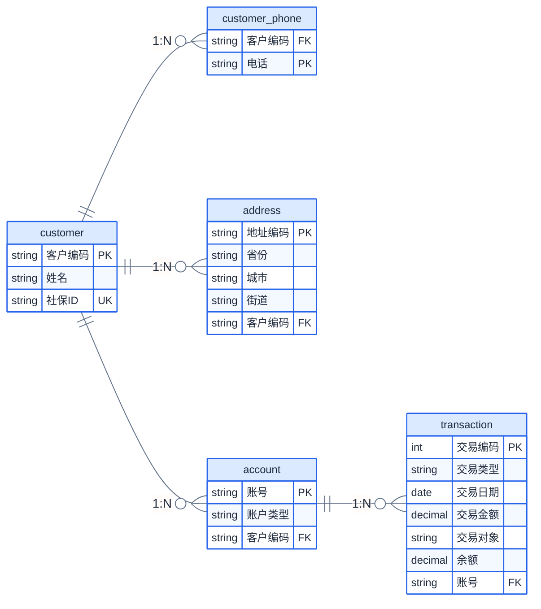

# 数据库原理 2021 参考答案

## 一、关系代数计算题（每小题2分，共10分）

关系R：

| A | B | C |
|:-:|:-:|:-:|
| 5 | 6 | 7 |
| 5 | 6 | 8 |
| 6 | 5 | 6 |
| 5 | 6 | 6 |
| 7 | 1 | 9 |

关系S：

| B | C |
|:-:|:-:|
| 6 | 6 |
| 6 | 8 |

### 1. $\pi_{A,B}(R)$

去重后：

| A | B |
|:-:|:-:|
| 5 | 6 |
| 6 | 5 |
| 7 | 1 |

### 2. $\sigma_{R.A=S.C}(R \times S)$

笛卡尔积($5 \times 2 = 10$元组)，选择 $R.A = S.C$ 的条件。$R.A \in \{5,6,7\}$，$S.C \in \{6,8\}$。
仅当 $R.A=6$ 时可以匹配 $S.C=6$。

结果：

| R.A | R.B | R.C | S.B | S.C |
|:---:|:---:|:---:|:---:|:---:|
| 6 | 5 | 6 | 6 | 6 |

### 3. $R \bowtie S$（自然连接）

公共属性B、C上等值连接：

- $(5,6,7)$: $B=6, C=7$ — 匹配 $S(6,6)$? $C \neq 6 \;\times$; 匹配 $S(6,8)$? $C \neq 8 \;\times$
- $(5,6,8)$: $B=6, C=8$ — 匹配 $S(6,8) \;\checkmark$
- $(6,5,6)$: $B=5$ — 不匹配 $\times$
- $(5,6,6)$: $B=6, C=6$ — 匹配 $S(6,6) \;\checkmark$
- $(7,1,9)$: $B=1$ — 不匹配 $\times$

| A | B | C |
|:-:|:-:|:-:|
| 5 | 6 | 8 |
| 5 | 6 | 6 |

### 4. $R \div S$

$S = \{(6,6), (6,8)\}$

检查每个A值：
- **$A=5$**: $\pi_{B,C}(\sigma_{A=5}(R)) = \{(6,7), (6,8), (6,6)\}$，包含 $\checkmark$
- **$A=6$**: $\{(5,6)\}$，不包含 $\times$
- **$A=7$**: $\{(1,9)\}$，不包含 $\times$

**结果**: $\{5\}$

### 5. $R \bowtie S$

同第3小题，自然连接：$\{(5,6,8), (5,6,6)\}$

---

## 二、关系代数与关系演算（每小题4分，共12分）

关系模式：Student(Sno, Sname, Sage, Ssex, Sdept), Course(Cno, Cname, Cpno), SC(Sno, Cno, Grade)

### 1. 查询王思敏同学选修的课程中考试及格的课程名

**关系代数**：
$\pi_{Cname}(\sigma_{Sname='王思敏' \land Grade \geq 60}(Student \bowtie SC \bowtie Course))$

**ALPHA语言**：
$\text{GET W (Course.Cname)}: \exists \text{SC} (\text{Student.Sno} = \text{SC.Sno} \land \text{SC.Cno} = \text{Course.Cno} \land \text{Student.Sname} = \text{'王思敏'} \land \text{SC.Grade} \geq 60)$

### 2. 查询既选修了10号课程又选修了21号课程的学生的学号和姓名

**关系代数**：
$\pi_{Sno,Sname}(Student \bowtie (\pi_{Sno}(\sigma_{Cno='10'}(SC)) \cap \pi_{Sno}(\sigma_{Cno='21'}(SC))))$

**ALPHA语言**：
$\text{GET W (Student.Sno, Student.Sname)}: \exists \text{SC1} \exists \text{SC2} (\text{SC1.Sno} = \text{Student.Sno} \land \text{SC1.Cno} = \text{'10'} \land \text{SC2.Sno} = \text{Student.Sno} \land \text{SC2.Cno} = \text{'21'})$

### 3. 查询只选修了1门课程的学生的学号和姓名

**关系代数**：
令 $T_1 = \pi_{Sno}(SC)$（至少选修1门课的学生）
令 $T_2 = \pi_{Sno}(SC \bowtie_{SC1.Sno=SC2.Sno \land SC1.Cno \neq SC2.Cno} \rho_{SC2}(SC))$（至少选修2门不同课的学生）
$T_1 - T_2$
然后与Student自然连接取得姓名。

**ALPHA语言**：
$\text{GET W (Student.Sno, Student.Sname)}: \exists \text{SC} (\text{SC.Sno} = \text{Student.Sno}) \land \neg \exists \text{SC1} \exists \text{SC2} (\text{SC1.Sno} = \text{Student.Sno} \land \text{SC2.Sno} = \text{Student.Sno} \land \text{SC1.Cno} \neq \text{SC2.Cno})$

---

## 三、SQL语言（每小题3分，共18分）

关系模式：emp(empno, ename, job, mgr, hiredate, sal, comm, deptno), dept(deptno, dname, loc)

### 1. 添加约束

```sql
ALTER TABLE emp ADD CONSTRAINT chk_hiredate
    CHECK (hiredate <= DATE '2021-07-08');

ALTER TABLE emp ADD CONSTRAINT chk_sal
    CHECK (sal >= 0);

ALTER TABLE emp ADD CONSTRAINT fk_deptno
    FOREIGN KEY (deptno) REFERENCES dept(deptno);
```

### 2. 查询比他/她的经理工资高且雇佣时间长的雇员的雇员号、雇员名以及工资

```sql
SELECT e.empno, e.ename, e.sal
FROM emp e JOIN emp m ON e.mgr = m.empno
WHERE e.sal > m.sal AND e.hiredate < m.hiredate;
```

### 3. 查询雇佣人数最多的部门的雇员的雇员号和雇员名

```sql
SELECT empno, ename
FROM emp
WHERE deptno IN (
    SELECT deptno FROM emp GROUP BY deptno
    HAVING COUNT(*) = (SELECT MAX(COUNT(*)) FROM emp GROUP BY deptno)
);
```

### 4. 创建CS部门工资在4000~9000元间的姓"张"的雇员视图

```sql
CREATE VIEW empv(eid, ename, salary) AS
SELECT empno, ename, sal
FROM emp
WHERE deptno = (SELECT deptno FROM dept WHERE dname = 'CS')
  AND sal BETWEEN 4000 AND 9000
  AND ename LIKE '张%';
```

### 5. 创建函数：给定一个雇员号，返回该雇员所在部门比他/她工资高的雇员数目

```sql
CREATE FUNCTION higher_sal_count(eno CHAR(10)) RETURNS INT
BEGIN
    DECLARE cnt INT;
    SELECT COUNT(*) INTO cnt
    FROM emp e2
    WHERE e2.deptno = (SELECT deptno FROM emp WHERE empno = eno)
      AND e2.sal > (SELECT sal FROM emp WHERE empno = eno);
    RETURN cnt;
END;
```

### 6. 创建触发器：更新工资前将旧信息插入salUpdate表

```sql
CREATE TRIGGER trg_sal_update
BEFORE UPDATE OF sal ON emp
FOR EACH ROW
BEGIN
    INSERT INTO salUpdate(eno, ename, oldSal, newSal)
    VALUES (OLD.empno, OLD.ename, OLD.sal, NEW.sal);
END;
```

---

## 四、关系数据理论（20分）

### 1. 关系模式 R(U, F)，U=ABCDE，F={AB→C, C→B, A→D, E→A}

#### (1) 计算 $(AB)_F^+$ 和 $(AE)_F^+$

**$(AB)_F^+$**:
- 初始: {A, B}
- AB→C: → {A, B, C}
- C→B: B已有
- A→D: → {A, B, C, D}
- E→A: E不在闭包中，无法使用
- 结果: $(AB)_F^+$ = **{A, B, C, D}**

**$(AE)_F^+$**:
- 初始: {A, E}
- E→A: A已有
- A→D: → {A, D, E}
- AB→C: B不在闭包中
- 结果: $(AE)_F^+$需要重新计算...

正确做法：
- 初始: {A, E}
- E→A → {A, E}（不变）
- A→D → {A, D, E}
- 此时有A和D，但AB→C需要B。需通过E以外的依赖... 

等等，让我重新计算。
- 初始: {A, E}
- E→A：加入A（已有）→ {A, E}
- A→D：加入D → {A, D, E}
- 没有其他依赖可用

等等，有没有遗漏？F={AB→C, C→B, A→D, E→A}。从{A,E}出发：
- E→A 得到A（已有）
- A→D 得到D
- 现在有{A,D,E}，没有B/C，所以无法推进

$(AE)_F^+$ = **{A, D, E}**

#### (2) 求R的所有候选码

属性分类：L = {E}（仅左部），LR = {A, B, C}（左右均出现），R = {D}（仅右部）。core = {E}。

E⁺ = {E, A, D} ≠ U。从 LR 逐个添加：

- **BE**: (BE)⁺ → E→A → A→D → AB→C → = U ✓。B⁺={B}≠U，E⁺≠U → 极小 → **候选码**
- **CE**: (CE)⁺ → C→B → E→A → A→D → = U ✓。C⁺={B,C}≠U，E⁺≠U → 极小 → **候选码**
- AE: (AE)⁺ = {A, D, E} ≠ U，不是。

候选码：**BE、CE**

主属性 = {B, C, E}，非主属性 = {A, D}。

#### (3) R最高满足第几范式？

检查 2NF：E → A，E 是候选码 BE 的**真子集**，A 是**非主属性** → 部分依赖 → **不满足 2NF ✗**。

（A → D 不构成部分依赖，因为 A 不是任一候选码的真子集。但 2NF 已因 E→A 炸掉。）

**$R$最高满足 1NF。**

### 2. 求F的最小依赖集

F={A→B, C→A, B→AD, D→AB, BD→C}，U={A,B,C,D}

**Step 1**: 右部拆分：
F₁ = {A→B, C→A, B→A, B→D, D→A, D→B, BD→C}

**Step 2**: 去冗余：
- A→B：去掉后$(A)^+$={A}，不含B → 保留
- C→A：去掉后$(C)^+$={C}，不含A → 保留
- B→A：去掉后$(B)^+$={B, D, A}（B→D保留，D→A保留），含A → **删除**
- B→D：去掉后$(B)^+$={B}（B→A已删），不含D → 保留
- D→A：去掉后$(D)^+$={D, B}（D→B保留），B→D自循环。$(D)^+$={D,B}不含A → 保留
- D→B：去掉后$(D)^+$={D, A}（D→A保留），A→B→{D,A,B}含B → **删除**
- BD→C：去掉后$(BD)^+$={B,D}加上所有单属性依赖：B→D已有，D→A→{B,D,A}，A→B→{B,D,A}，不含C → 保留

但需要重新检查BD→C的左部是否可缩减：
- B→C？$(B)^+$={B, D, A}，不含C
- D→C？$(D)^+$={D, A, B}，不含C

BD→C保留。

F₂ = {A→B, C→A, B→D, D→A, BD→C}

再检查BD→C：去掉后$(BD)^+$={B,D}→{B,D,A}（D→A）→{B,D,A,B}（A→B，已有），不含C。保留。

**F的最小依赖集**: $F_{min} = \{A \rightarrow B,\; C \rightarrow A,\; B \rightarrow D,\; D \rightarrow A,\; BD \rightarrow C\}$

### 3. 证明任一二目关系模式R(A,B)都属于BCNF

**证明**：设$R$为二目关系模式，属性集 $U = \{A, B\}$。

$R$中所有可能的非平凡函数依赖为：$A \rightarrow B$，$B \rightarrow A$。

情况分析：
- 若 $F = \varnothing$（无任何非平凡函数依赖）：则$A$、$B$共同构成唯一候选码 $\{A,B\}$，且无非平凡FD，满足BCNF。
- 若 $A \rightarrow B$ 成立（且 $B \rightarrow A$ 不成立）：则$A$是候选码，$A \rightarrow B$的左边$A$是超码，满足BCNF。
- 若 $B \rightarrow A$ 成立（且 $A \rightarrow B$ 不成立）：同理，$B$是候选码，满足BCNF。
- 若 $A \rightarrow B$ 且 $B \rightarrow A$ 均成立：则$A$和$B$各自都是候选码，每个FD左边都是超码，满足BCNF。

所有情况均满足BCNF。**证毕。**

---

## 五、数据库设计（15分）

### 1. E-R图



### 2. E-R模型转关系模型

- **客户**（<u>客户编码</u>, 姓名, 社保ID）
- **地址**（<u>地址编码</u>, 省份, 城市, 街道, 客户编码），外码：客户编码 REFERENCES 客户
- **联系电话**（<u>客户编码</u>, <u>电话</u>），外码：客户编码 REFERENCES 客户
- **账户**（<u>账号</u>, 账户类型, 客户编码），外码：客户编码 REFERENCES 客户
- **交易记录**（<u>交易编码</u>, 交易类型, 交易日期, 交易金额, 交易对象, 余额, 账号），外码：账号 REFERENCES 账户

### 3. SQL建表

```sql
CREATE TABLE Customer (
    cust_id     CHAR(10) PRIMARY KEY,
    cust_name   VARCHAR(50) NOT NULL,
    ssn         CHAR(18) UNIQUE
);
```

---

## 六、查询优化（10分）

StarsIn(movieTitle, movieYear, starName)：10块，1星→3电影，1电影→3星。

### 1. SELECT movieTitle, movieYear FROM StarsIn WHERE starName=s

| 索引 | 块读 | 说明 |
|------|:----:|------|
| 无索引 | **10** | 全表扫描 |
| starName索引 | **4** | 1(索引块)+3(数据块:3条记录散落) |
| movieTitle索引 | **10** | 无效利用 |
| 两者都有 | **4** | 利用starName索引 |

### 2. SELECT starName FROM StarsIn WHERE movieTitle=t AND movieYear=y

| 索引 | 块读 | 说明 |
|------|:----:|------|
| 无索引 | **10** | 全表扫描 |
| starName索引 | **10** | 无效利用 |
| movieTitle索引 | **4** | 1(索引块)+3(数据块) |
| 两者都有 | **4** | 利用movieTitle索引 |

---

## 七、并发控制与数据库恢复（15分）

### 1. 冲突可串行化分析

优先图分析：
- $T_2: \text{Write}(X) \rightarrow T_1: \text{Read}(X) \;\Rightarrow\; T_2 \rightarrow T_1$
- $T_2: \text{Write}(X) \rightarrow T_1: \text{Write}(X) \;\Rightarrow\; T_2 \rightarrow T_1$
- $T_1: \text{Write}(X) \rightarrow T_3: \text{Read}(X) \;\Rightarrow\; T_1 \rightarrow T_3$
- $T_2: \text{Write}(Y) \rightarrow T_1: \text{Read}(Y) \;\Rightarrow\; T_2 \rightarrow T_1$
- $T_1: \text{Write}(Y) \rightarrow T_3: \text{Read}(Y) \;\Rightarrow\; T_1 \rightarrow T_3$
- $T_1: \text{Write}(Y) \rightarrow T_3: \text{Write}(Y) \;\Rightarrow\; T_1 \rightarrow T_3$
- $T_2: \text{Write}(X) \rightarrow T_3: \text{Write}(X) \;\Rightarrow\; T_2 \rightarrow T_3$

优先图：$T_2 \rightarrow T_1 \rightarrow T_3$，无环。

**调度S是冲突可串行化的，等价串行为：$T_2 \rightarrow T_1 \rightarrow T_3$。**

### 2. 并发调度序列分析

$T_1: \text{Read}(B);\; A = B+2;\; \text{Write}(A)$
$T_2: \text{Read}(A);\; B = A-2;\; \text{Write}(B)$
初值: $A=4$, $B=4$

**串行 $T_1 \rightarrow T_2$**: $A = 4+2 = 6$; $B = 6-2 = 4$ → $A=6$, $B=4$
**串行 $T_2 \rightarrow T_1$**: $B = 4-2 = 2$; $A = 2+2 = 4$ → $A=4$, $B=2$

**交错调度**：
- $T_1$读$B=4$ → $T_2$读$A=4$ → $T_1$: $A=6$, 写$A=6$ → $T_2$: $B=4-2=2$, 写$B=2$ → $A=6$, $B=2$
- $T_1$读$B=4$ → $T_1$: $A=6$, 写$A=6$ → $T_2$读$A=6$ → $T_2$: $B=6-2=4$, 写$B=4$ → $A=6$, $B=4$（等于$T_1 \rightarrow T_2$）
- $T_2$读$A=4$ → $T_2$: $B=2$, 写$B=2$ → $T_1$读$B=2$ → $T_1$: $A=4$, 写$A=4$ → $A=4$, $B=2$（等于$T_2 \rightarrow T_1$）

**正确调度**：$T_1 \rightarrow T_2$ 和 $T_2 \rightarrow T_1$ 均为正确调度。

### 3. 日志恢复

日志（A、B、C初值=0）：

| 序号 | 日志 | | 序号 | 日志 |
|:---:|------|-|:---:|------|
| 1 | T1: Start | | 9 | T2: Write(A), A=8 |
| 2 | T1: Write(A), A=9 | | 10 | T3: Commit |
| 3 | T3: Start | | 11 | T2: Write(B), B=7 |
| 4 | T3: Write(C), C=10 | | 12 | T4: Start |
| 5 | T1: Write(B), B=11 | | 13 | T2: Commit |
| 6 | T1: Rollback | | 14 | T4: Write(C), C=13 |
| 7 | T3: Write(B), B=12 | | 15 | T4: Write(B), B=15 |
| 8 | T2: Start | | | |

**(1) 故障在15之后**：
- 已提交: $T_3$, $T_2$
- 未完成: $T_4$
- **REDO: $T_3$, $T_2$; UNDO: $T_4$**
- 恢复后: $A=8$, $B=7$, $C=10$

**(2) 故障在10之后**：
- 已提交: $T_3$
- $T_1$已Rollback
- 未完成: $T_2$
- **REDO: $T_3$; UNDO: $T_2$**
- 恢复后: $A=0$ ($T_1$回滚撤销$A=9$，$T_2$被UNDO撤销$A=8$), $B=12$ ($T_3$写入), $C=10$ ($T_3$写入)

**(3) 故障在7之后**：
- $T_1$已Rollback
- $T_3$未Commit
- **REDO: 无; UNDO: $T_3$**
- 恢复后: $A=0$, $B=0$, $C=0$

**(4) 故障在15之后，值**：
- REDO $T_3$: $C=10$, $B=12$
- REDO $T_2$: $A=8$, $B=7$ (覆盖$T_3$的$B$)
- UNDO $T_4$: 撤销$C=13$, $B=15$
- **$A=8$, $B=7$, $C=10$**

**(5) 故障在7之后，值**：
- REDO: 无
- UNDO $T_3$: 撤销$C=10$, $B=12$
- $T_1$已ROLLBACK
- **$A=0$, $B=0$, $C=0$**
