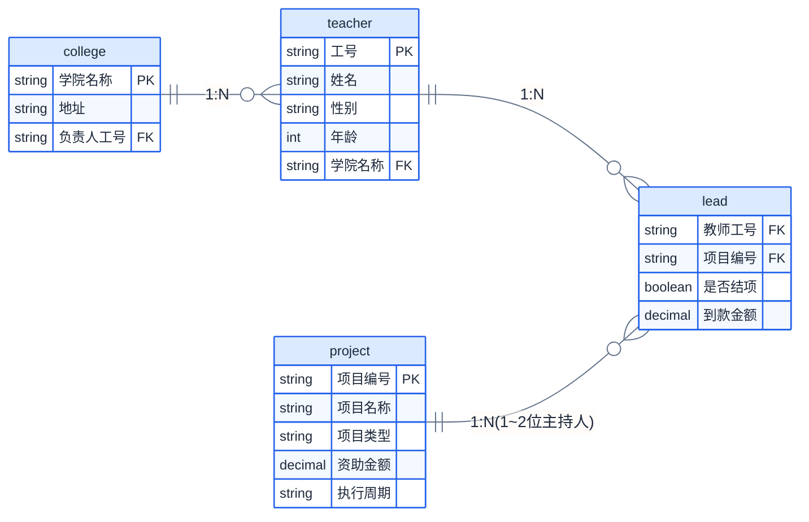

# 数据库原理 2022春 A卷 参考答案

## 一、关系代数计算题（每小题2分，共10分）

关系R：

| A | B | C |
|:-:|:-:|:-:|
| 5 | 6 | 8 |
| 5 | 6 | 6 |
| 6 | 5 | 6 |
| 5 | 6 | 7 |
| 6 | 1 | 8 |

关系S：

| B | C |
|:-:|:-:|
| 6 | 6 |
| 6 | 8 |

### 1. $\pi_{A,B}(R)$

去重结果：

| A | B |
|:-:|:-:|
| 5 | 6 |
| 6 | 5 |
| 6 | 1 |

### 2. $\sigma_{R.A=S.B}(R \times S)$

$R.A \in \{5,6\}$，$S.B \in \{6,6\}$，仅当 $R.A=6$ 时匹配。

笛卡尔积($5 \times 2 = 10$)中选择 $R.A = S.B$：

| R.A | R.B | R.C | S.B | S.C |
|:---:|:---:|:---:|:---:|:---:|
| 6 | 5 | 6 | 6 | 6 |
| 6 | 5 | 6 | 6 | 8 |
| 6 | 1 | 8 | 6 | 6 |
| 6 | 1 | 8 | 6 | 8 |

### 3. $S \bowtie R$（自然连接）

公共属性$B$、$C$等值连接，等同于 $R \bowtie S$：

- $(6,6) \in S$，$R$中$B=6,C=6$的元组$(5,6,6)$和$(6,5,6)$匹配
- $(6,8) \in S$，$R$中$B=6,C=8$的元组$(5,6,8)$和$(6,1,8)$匹配

| S.B | S.C | A |
|:---:|:---:|:-:|
| 6 | 6 | 5 |
| 6 | 6 | 6 |
| 6 | 8 | 5 |
| 6 | 8 | 6 |

### 4. $R \div S$

$S = \{(6,6), (6,8)\}$

检查每个$A$值：
- **$A=5$**: $\pi_{B,C}(\sigma_{A=5}(R)) = \{(6,8), (6,6), (6,7)\}$，包含$S$全部元组 $\checkmark$
- **$A=6$**: $\pi_{B,C}(\sigma_{A=6}(R)) = \{(5,6), (1,8)\}$，不包含 $\times$

**结果**: $\{5\}$

### 5. $\pi_{B,C}(R) - S$

π_{B,C}(R)：

| B | C |
|:-:|:-:|
| 6 | 8 |
| 6 | 6 |
| 6 | 7 |
| 5 | 6 |
| 1 | 8 |

S：

| B | C |
|:-:|:-:|
| 6 | 6 |
| 6 | 8 |

差集运算结果（在π_{B,C}(R)中但不在S中）：

| B | C |
|:-:|:-:|
| 6 | 7 |
| 5 | 6 |
| 1 | 8 |

---

## 二、关系代数与关系演算（每小题4分，共12分）

关系模式：Student(Sno, Sname, Sage, Ssex, Sdept), Course(Cno, Cname, Cpno), SC(Sno, Cno, Grade)

### 1. 查询选修课程中有考试不及格的学生姓名和学号

**关系代数**：
$\pi_{Sname, Sno}(Student \bowtie \pi_{Sno}(\sigma_{Grade < 60}(SC)))$

**ALPHA语言**：
$\text{GET W (Student.Sname, Student.Sno)}: \exists \text{SC} (\text{SC.Sno} = \text{Student.Sno} \land \text{SC.Grade} < 60)$

### 2. 查询选修了5号课程但没选修7号课程的学生的学号和姓名

**关系代数**：
$\pi_{Sno, Sname}(Student \bowtie (\pi_{Sno}(\sigma_{Cno='5'}(SC)) - \pi_{Sno}(\sigma_{Cno='7'}(SC))))$

**ALPHA语言**：
$\text{GET W (Student.Sno, Student.Sname)}: \exists \text{SC} (\text{SC.Sno} = \text{Student.Sno} \land \text{SC.Cno} = \text{'5'}) \land \neg \exists \text{SC2} (\text{SC2.Sno} = \text{Student.Sno} \land \text{SC2.Cno} = \text{'7'})$

### 3. 查询只选修了一门课的学生学号

**关系代数**：
$\pi_{Sno}(SC) - \pi_{Sno}(\sigma_{Cno1 \neq Cno2}(\rho_{SC1}(SC) \bowtie_{SC1.Sno=SC2.Sno} \rho_{SC2}(SC)))$

**ALPHA语言**：
$\text{GET W (Student.Sno)}: \exists \text{SC} (\text{SC.Sno} = \text{Student.Sno}) \land \neg \exists \text{SC1} \exists \text{SC2} (\text{SC1.Sno} = \text{Student.Sno} \land \text{SC2.Sno} = \text{Student.Sno} \land \text{SC1.Cno} \neq \text{SC2.Cno})$

---

## 三、SQL语言（每小题3分，共18分）

关系模式：emp(empno, ename, job, mgr, hiredate, sal, comm, deptno), dept(deptno, dname, loc)

### 1. 创建emp表并添加约束

```sql
CREATE TABLE emp (
    empno    CHAR(10) PRIMARY KEY,
    ename    VARCHAR(50) NOT NULL,
    job      VARCHAR(20),
    mgr      CHAR(10),
    hiredate DATE,
    sal      DECIMAL(10,2),
    comm     DECIMAL(10,2),
    deptno   CHAR(10),
    CONSTRAINT fk_mgr FOREIGN KEY (mgr) REFERENCES emp(empno),
    CONSTRAINT chk_sal CHECK (sal BETWEEN 3000 AND 100000),
    CONSTRAINT uq_ename UNIQUE (ename)
);
```

### 2. 查询比他/她的经理工资高的雇员的雇员号、雇员名以及工资

```sql
SELECT e.empno, e.ename, e.sal
FROM emp e JOIN emp m ON e.mgr = m.empno
WHERE e.sal > m.sal;
```

### 3. 查询雇员人数一样多的部门的部门号和雇员人数

```sql
SELECT deptno, COUNT(*) AS cnt
FROM emp
GROUP BY deptno
HAVING COUNT(*) IN (
    SELECT COUNT(*)
    FROM emp
    GROUP BY deptno
    GROUP BY COUNT(*)
    HAVING COUNT(*) > 1
);
```

或使用子查询找出现次数≥2的人数：
```sql
SELECT deptno, COUNT(*) AS cnt
FROM emp
GROUP BY deptno
HAVING COUNT(*) IN (
    SELECT cnt FROM (
        SELECT COUNT(*) AS cnt FROM emp GROUP BY deptno
    ) t GROUP BY cnt HAVING COUNT(*) >= 2
);
```

### 4. 创建IT部门2020年6月30日后入职的"李"姓雇员视图

```sql
CREATE VIEW empv(eid, ename, salary) AS
SELECT empno, ename, sal
FROM emp
WHERE deptno = (SELECT deptno FROM dept WHERE dname = 'IT')
  AND hiredate > DATE '2020-06-30'
  AND ename LIKE '李%';
```

### 5. 删除经理"张三"管理的所有雇员

```sql
DELETE FROM emp
WHERE mgr = (SELECT empno FROM emp WHERE ename = '张三');
```

### 6. 查询各部门员工的平均工资、最高工资和最低工资，按部门号排序

```sql
SELECT deptno, AVG(sal) AS avg_sal, MAX(sal) AS max_sal, MIN(sal) AS min_sal
FROM emp
GROUP BY deptno
ORDER BY deptno;
```

---

## 四、关系数据理论（20分）

### 1. 关系模式 R(U, F)，U=ABCDE，F={AB→C, C→B, A→D, E→B}

#### (1) 计算 $(AB)_F^+$ 和 $(AE)_F^+$

**$(AB)_F^+$**:
- 初始: {A, B}
- AB→C: → {A, B, C}
- C→B: B已有
- A→D: → {A, B, C, D}
- E→B: E不在闭包中
- 结果: **{A, B, C, D}**

**$(AE)_F^+$**:
- 初始: {A, E}
- E→B: → {A, B, E}
- A→D: → {A, B, D, E}
- AB→C: A和B都在→{A, B, C, D, E} = U
- 结果: **{A, B, C, D, E} = U**

#### (2) 求R的所有候选码

$(AE)^+ = U$。需验证AE是否为最小：
- $(A)^+$ = {A, D}，不含BCE
- $(E)^+$ = {E, B}，不含ACD
- AE无真子集能决定U

**候选码：AE**

是否还有其他候选码？检查AB:
$(AB)^+$ = {A,B,C,D} ≠ U（缺E）

检查AC:
$(AC)^+$ → A→D → {A,C,D} → C→B → {A,B,C,D} ≠ U，缺E

因此唯一候选码为 **AE**。

#### (3) R最高满足第几范式？

AE→U是候选码，非主属性为B,C,D。

检查是否存在非主属性对候选码的部分函数依赖：
- A→D：A⊂AE，D是非主属性 → 部分函数依赖！

不满足2NF。**R最高满足1NF。**

### 2. 求F的最小依赖集

F={A→BE, D→A, A→C, BD→C}, U={A,B,C,D,E}

**Step 1**: 右部拆分：
F₁ = {A→B, A→E, D→A, A→C, BD→C}

**Step 2**: 去冗余：
- A→B：去掉后$(A)^+$={A, E, C}（A→E保留，A→C保留），不含B → 保留
- A→E：去掉后$(A)^+$={A, B, C}（A→B保留，A→C保留），不含E → 保留
- D→A：去掉后$(D)^+$={D}，不含A → 保留
- A→C：去掉后$(A)^+$={A, B, E}，从A→B和A→E无法得到C。等等，检查BD→C：需要B和D，但A→B推出B，没有D。$(A)^+$={A,B,E}，不含C → 保留
- BD→C：去掉后$(BD)^+$={B,D}→D→A→{A,B,D}→A→E（A→E保留）→{A,B,D,E}，不含C → 保留

去掉BD→C后，再检查左部缩减：
- B→C？$(B)^+$={B}，不含C → 不能缩减为B→C
- D→C？$(D)^+$={D,A,B,E,C}...

等等，重新计算：F₁更新为{A→B, A→E, D→A, A→C}后，BD→C被删掉了吗？让我重新确认。

F₁ = {A→B, A→E, D→A, A→C, BD→C}

逐个检查：
- A→B: $(A)^+_{F₁-{A→B}}$ = {A, E, C}（A→E, A→C），不含B → 保留
- A→E: $(A)^+_{F₁-{A→E}}$ = {A, B, C}（A→B, A→C），不含E → 保留
- D→A: $(D)^+_{F₁-{D→A}}$ = {D}，不含A → 保留
- A→C: $(A)^+_{F₁-{A→C}}$ = {A, B, E}，不含C → 保留

现在F₂ = {A→B, A→E, D→A, A→C}再加BD→C。

- BD→C: $(BD)^+_{F₂-{BD→C}}$ = 从{B,D}出发：D→A→{A,B,D}→A→E→{A,B,D,E}→A→C→{A,B,C,D,E}=U，含C → **BD→C冗余，删除**

**Step 3**: 左部缩减：所有依赖左部已为单属性。

**F的最小依赖集**: $F_{min} = \{A \rightarrow B,\; A \rightarrow E,\; D \rightarrow A,\; A \rightarrow C\}$

等价合并：$F_{min} = \{A \rightarrow BCE,\; D \rightarrow A\}$

### 3. 证明任何二目关系模式R(A,B)都属于BCNF

同2020卷第四题第3小题证明。

令 $R(A,B)$ 的属性集 $U = \{A, B\}$，可能的非平凡FD只有 $A \rightarrow B$ 和 $B \rightarrow A$。

四种情况：
1. $F = \varnothing$：唯一候选码 $AB$，无违反BCNF的FD
2. $A \rightarrow B$ 成立（$B \rightarrow A$ 不成立）：$A$是候选码，FD左边$A$是超码
3. $B \rightarrow A$ 成立（$A \rightarrow B$ 不成立）：$B$是候选码，FD左边$B$是超码
4. $A \rightarrow B$ 且 $B \rightarrow A$ 均成立：$A$和$B$各自都是候选码

所有FD的左边均为超码，故 $R \in \text{BCNF}$。**证毕。**

---

## 五、数据库设计（15分）

### 1. E-R图



### 2. E-R模型转关系模型

- **学院**（<u>学院名称</u>, 地址, 负责人工号），外码：负责人工号 REFERENCES 教师(工号)
- **教师**（<u>工号</u>, 姓名, 性别, 年龄, 学院名称），外码：学院名称 REFERENCES 学院
- **项目**（<u>项目编号</u>, 项目名称, 项目类型, 资助金额, 执行周期）
- **主持**（<u>教师工号</u>, <u>项目编号</u>, 是否结项, 到款金额），外码：教师工号 REFERENCES 教师, 项目编号 REFERENCES 项目

注意：学院(负责人工号)依赖教师(工号)，存在参照环，可先创建教师表再添加外码约束。

### 3. SQL建表（以"主持"关系为例）

```sql
CREATE TABLE Lead (
    teacher_id  CHAR(10),
    project_id  CHAR(10),
    is_finished BOOLEAN,
    amount      DECIMAL(12,2),
    PRIMARY KEY (teacher_id, project_id),
    FOREIGN KEY (teacher_id) REFERENCES Teacher(emp_id),
    FOREIGN KEY (project_id) REFERENCES Project(proj_id)
);
```

---

## 六、查询优化（10分）

数据库模式：Student(Sno, Sname, Sage, Ssex, Sdept); Course(Cno, Cname, Credit); SC(Sno, Cno, Grade)

查询：检索CS系选修DB课程90分以上的男学生的姓名、学号、DB课成绩。

### 1. 初始关系代数表达式

$\pi_{Sname, Student.Sno, Grade}(\sigma_{Sdept='CS' \land Cname='DB' \land Grade>90 \land Ssex='男'}(Student \times Course \times SC))$

### 2. 原始查询树

```
         π_{Sname,Sno,Grade}
              │
         σ_{Sdept='CS' ∧ Cname='DB' ∧ Grade>90 ∧ Ssex='男'}
              │
              ×
            /   \
           ×    Course
         /   \
     Student  SC
```

### 3. 启发式优化

**Step 1**: 选择条件分解下推
- σ_{Sdept='CS' ∧ Ssex='男'} 下推到 Student
- σ_{Cname='DB'} 下推到 Course
- σ_{Grade>90} 下推到 SC

**Step 2**: 将笛卡尔积替换为自然连接

**Step 3**: 投影下推

优化后查询树：
```
      π_{Sname, Sno, Grade}
              │
      ⋈_{Student.Sno=SC.Sno ∧ SC.Cno=Course.Cno}
            /   \
           /     π_{Cno}(σ_{Cname='DB'}(Course))
          /      
      ⋈_{Student.Sno=SC.Sno}
       /          \
π_{Sno,Sname}      π_{Sno,Cno,Grade}
(σ_{Sdept='CS'     (σ_{Grade>90}(SC))
 ∧Ssex='男'}
 (Student))
```

优化后的SQL等价写法：
```sql
SELECT Sname, Student.Sno, Grade
FROM Student
JOIN SC ON Student.Sno = SC.Sno
JOIN Course ON SC.Cno = Course.Cno
WHERE Sdept = 'CS' AND Cname = 'DB'
  AND Grade > 90 AND Ssex = '男';
```

---

## 七、并发控制与数据库恢复（15分）

### 1. 冲突可串行化分析

调度S：
| T1 | T2 | T3 |
|:--:|:--:|:--:|
| Read(X) | | |
| Write(X) | | |
| | Read(X) | |
| | | Read(Y) |
| | Write(X) | |
| | | Read(X) |
| | Read(Y) | |
| | | Write(X) |
| | Write(Y) | |
| Read(Y) | | |
| Write(Y) | | |
| | | Write(Y) |

**优先图构造**：
- $T_1: \text{Write}(X) \rightarrow T_2: \text{Read}(X) \;\Rightarrow\; T_1 \rightarrow T_2$
- $T_1: \text{Write}(X) \rightarrow T_2: \text{Write}(X) \;\Rightarrow\; T_1 \rightarrow T_2$
- $T_1: \text{Write}(X) \rightarrow T_3: \text{Read}(X) \;\Rightarrow\; T_1 \rightarrow T_3$
- $T_2: \text{Write}(X) \rightarrow T_3: \text{Write}(X) \;\Rightarrow\; T_2 \rightarrow T_3$
- $T_2: \text{Write}(Y) \rightarrow T_1: \text{Read}(Y) \;\Rightarrow\; T_2 \rightarrow T_1$
- $T_2: \text{Write}(Y) \rightarrow T_3: \text{Write}(Y) \;\Rightarrow\; T_2 \rightarrow T_3$
- $T_1: \text{Write}(Y) \rightarrow T_3: \text{Write}(Y) \;\Rightarrow\; T_1 \rightarrow T_3$

优先图：$T_1 \rightarrow T_2$，$T_2 \rightarrow T_1$ 形成环（$T_1 \rightarrow T_2 \rightarrow T_1$）。

**调度S不是冲突可串行化的**，因为优先图中存在环路。

### 2. 并发调度分析

$T_1: \text{Read}(A);\; B = A-3;\; \text{Write}(B)$
$T_2: \text{Read}(B);\; A = B+4;\; \text{Write}(A)$
初值：$A=7$, $B=2$

**三种可能的并发执行及结果**：

1. **$T_1 \rightarrow T_2$ 串行**：$T_1: B=7-3=4$; $T_2: A=4+4=8$ → **$A=8$, $B=4$**

2. **$T_2 \rightarrow T_1$ 串行**：$T_2: A=2+4=6$; $T_1: B=6-3=3$ → **$A=6$, $B=3$**

3. **交错**：$T_1$读$A=7$ → $T_2$读$B=2$ → $T_1$写$B=4$ → $T_2$写$A=6$ → **$A=6$, $B=4$**

**两种正确调度**：$T_1 \rightarrow T_2$（$A=8, B=4$）和 $T_2 \rightarrow T_1$（$A=6, B=3$）。

### 3. 带检查点的日志恢复

日志（初值均为0）：

| 序号 | 日志 | | 序号 | 日志 |
|:---:|------|-|:---:|------|
| 1 | T1: Start | | 13 | T5: Write(A) |
| 2 | T3: Start | | 14 | T2: Commit |
| 3 | T2: Start | | 15 | T4: Rollback |
| 4 | T1: Write(A) | | 16 | T5: Write(B) |
| 5 | T3: Write(C) | | 17 | T8: Start |
| 6 | T1: Rollback | | 18 | T6: Write(A) |
| 7 | T3: Commit | | 19 | T6: Commit |
| 8 | T2: Write(C) | | 20 | **Checkpoint** |
| 9 | T5: Start | | 21 | T8: Write(A) |
| 10 | T7: Start | | 22 | T8: Commit |
| 11 | T4: Start | | 23 | T7: Write(B) |
| 12 | T6: Start | | 24 | T5: Write(C) |

**(1) 故障发生在14之后**（序号14执行后，序号15前）：

此时检查点在序号20，故障发生在检查点之前，检查点尚未执行。

在序号14之后：
- 已提交：$T_3$（序号7）, $T_2$（序号14）
- 已回滚：$T_1$（序号6）
- 进行中：$T_5$（序号9 Started，序号13有Write，未Commit），$T_7$（序号10 Started），$T_4$（序号11 Started），$T_6$（序号12 Started）

**REDO: $T_3$, $T_2$**（已提交的事务需重做）
**UNDO: $T_5$, $T_7$, $T_4$, $T_6$**（未提交的事务需回滚）

**(2) 故障发生在21之后**（序号21执行后，序号22前）：

检查点在序号20，故障发生在检查点之后。

检查点前的状态：
- $T_1$: 已Rollback $\checkmark$
- $T_3$: 已Commit（序号7）$\checkmark$
- $T_2$: 已Commit（序号14）$\checkmark$
- $T_4$: 已Rollback（序号15）$\checkmark$
- $T_6$: 已Commit（序号19）$\checkmark$
- $T_5$: 活跃（已Started序号9，未Commit）
- $T_7$: 活跃（已Started序号10，未Commit）
- $T_8$: 已Started（序号17）

检查点时的活跃事务：$T_5$, $T_7$（均未Commit/Rollback）

带检查点的恢复算法：
1. 从检查点向后扫描，初始化UNDO列表 = {$T_5$, $T_7$}，REDO列表 = $\varnothing$
2. 序号21: $T_8$: $\text{Write}(A)$ → $T_8$已Start但未Commit，仍在UNDO中
3. 故障点（序号21之后，序号22之前）：$T_8$未Commit

UNDO列表：{$T_5$, $T_7$, $T_8$}

**REDO: 无**（检查点后没有事务Commit）
**UNDO: $T_5$, $T_7$, $T_8$**
